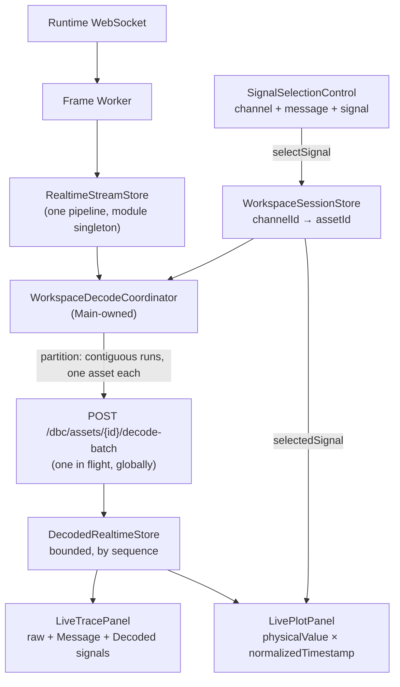

# V0.3-14 — Live DBC Decode, Trace & Plot Integration

> **Phase**: V0.3-14 — the last product phase of V0.3
> **Branch**: `feature/v0.3-14-live-dbc-decode-trace-plot-integration`
> **Base**: `origin/main` = `5ed3945450aff5099d5e6b4d40f59c4fcdac1bb0`
> **Status**: `IMPLEMENTED · SELF-VERIFIED · AWAITING INDEPENDENT ACCEPTANCE`
> **Final Acceptance**: NOT CLAIMED · **Status: CLOSED**: NOT CLAIMED

Written by the development agent. It records what was implemented and what was actually run;
it grants no verdict. Independent acceptance is external.

---

## 1. Objective

The phase connects the pieces V0.3-13 left adjacent but unwired — project open, DBC import, DBC
workspace, channel→asset binding, the Runtime decode-batch API and the realtime frame stream —
into one live engineering workflow: **Open Project → Import DBC → browse DBC → bind a channel to
an asset → frames arrive → the binding finds the asset → `decode-batch` → decoded values appear in
Trace beside the raw frame → the user explicitly picks channel + message + signal → Plot draws that
signal's physical value.**

The Runtime was not modified (`§6` of the phase brief: `NO Runtime change`), and the existing
`POST /dbc/assets/{asset_id}/decode-batch` contract was sufficient for the whole phase.



---

## 2. What was built

### 2.1 Shared contracts frozen before dispatch (Main Agent)

| Commit | Content |
|---|---|
| `a4b04f9` | `SignalSelection` hardened to a channel-bound identity (`workspace/session.ts`) |
| `502ea82` | `DecodedRealtimeStore` contract (`workspace/decoded-realtime.ts`) |
| `c631af9` | Runtime HTTP **transport extracted** to `runtime/runtime-http.ts` (§16): one origin, one 2xx/non-2xx split, one failure taxonomy — so the decode client re-uses rather than copies it. `dbc-client.ts` re-exports the three error types, so every existing consumer is unchanged. |
| `2428b19` | The phase's i18n key surface (`trace.column.message`, `trace.column.signals`, `trace.value.none`, `plot.title` re-worded, `plot.noSelection.*`, `plot.waiting`, `dbc.signal.plot`, `dbc.selection.*`); `plot.byte0` removed with the byte behaviour it named. |

Freezing the string surface before dispatch is what let three workers own disjoint files: none of
them had to touch `i18n/config.ts`.

### 2.2 The three workers (native-shared, pairwise C0)

| Task | Commit | Owned files |
|---|---|---|
| V0.3-14-A | `32d5e17` | `runtime/dbc-decode-client.{ts,test.ts}` |
| V0.3-14-B | `546e6af` | `components/trace/**` (4 files) |
| V0.3-14-C | `0519e18` | `components/plot/**`, `components/dbc/SignalSelectionControl.*` |

### 2.3 Main Agent integration

| Commit | Content |
|---|---|
| `80413d8` | `workspace/decode-partition.ts` (pure) + `workspace/decode-coordinator.ts` |
| `c92f1af` | Wire into `DockWorkspace.tsx`; `SignalSelectionControl` mounted in `DbcWorkspace.tsx` |
| `236e005` | End-to-end flows 1–8 |
| `a2771c0` | Task contracts, plan and handoffs (governance) |

---

## 3. The coordinator — the phase's critical algorithm

`partitionDecodeRuns(frames, assetForChannel, maxRunLength)` cuts a viewport into runs that are each
**one asset × contiguous sequence × ≤1000 frames**, because the Runtime's `FrameBatch.create()`
requires contiguity and an interleaved viewport cannot be sent as "all the `can0` frames".

```text
input:   1 can0→A   2 can1→B   3 can0→A   4 can0→A   5 can1→B
output:  A[1]       B[2]       A[3,4]              B[5]
NOT:     A[1,3,4]   B[2,5]        ← 1 → 3 is not contiguous; this is the bug the module prevents
```

A frame whose channel is unbound contributes no run **and ends the run in progress**: it occupies a
sequence number, so joining its neighbours would manufacture exactly that hole.

The coordinator that drives it holds seven properties (each covered by a test):

* **One request in flight, globally** — not per asset, not per viewport. A burst of snapshots
  becomes one further pass after the outstanding response lands.
* **Newest viewport wins** — the pass re-reads the current snapshot and current bindings; nothing is
  queued, so a slow Runtime cannot make the UI fall behind the bus.
* **A binding change is an epoch** — opening another project, binding, rebinding, unbinding or
  clearing advances a generation, clears the decoded store, and discards an in-flight answer.
* **A stream change is an epoch** — a new `streamId` forgets the processed set and resets the store.
* **Every answered frame is remembered, failures included** — otherwise one undecodable frame would
  be re-requested on every viewport update for the rest of the capture.
* **A request failure is not a frame failure** — recorded as `lastError`, clearing nothing; the same
  viewport is not retried in a tight loop against an unavailable Runtime.
* **Disposal is final** — `start()`'s unsubscribe detaches both subscriptions and advances the
  generation.

---

## 4. Tests

### 4.1 Counts (all from this session's tool output)

```text
before the phase            23 test files / 346 tests passed
after  the phase            31 test files / 461 tests passed        (+8 files, +115 tests)

worker focused suites (re-run by the Main Agent, not taken from worker reports)
  A  runtime/dbc-decode-client.test.ts                        1 file  /  36 tests
  B  components/trace                                         2 files /  15 tests
  C  components/plot + components/dbc/SignalSelectionControl   3 files /  24 tests
Main-owned
  workspace/decode-partition.test.ts                          8 tests
  workspace/decode-coordinator.test.ts                       13 tests
  workspace/live-decode-flows.integration.test.tsx           10 tests  (flows 1–8)
```

Test-count reconciliation: `+115` new, `−3` removed. The three removed are `buildByteSeries`'s own
byte-series tests in `components/plot/series.test.ts`; the function was deleted rather than left
unwired, because a pure function with no production caller is dead code. Its deterministic
reduction (even stride, first and last sample kept) is carried over verbatim into
`buildSignalSeries`, so the coverage was replaced rather than dropped. The panel's other
assertions moved from `getByText` to the existing `messageRow` helper, because the page now renders
each message name twice (the definition table and the selection control's option) — the assertions
are unchanged, only their locator is now unambiguous.

### 4.2 RED → GREEN observed, not asserted

* `decode-partition.test.ts` was written first and failed with `Failed to resolve import
  "./decode-partition"`; the implementation then made 8/8 pass.
* `decode-coordinator.test.ts` was written first and failed the same way; on first run against the
  implementation it produced **1 failed / 12 passed** — the coordinator completed a response and did
  not continue with the rest of the viewport. That is a real behavioural RED, and the fix
  (unconditional re-pass in `finally`, with `#inFlight` as the only serialisation) is what §57 asks
  for.
* `live-decode-flows.integration.test.tsx` first produced **2 failed / 8 passed** — the freeze flows
  could not find the Freeze control because the suite had not initialised i18n. Fixed by importing
  the shared config, exactly as the sibling panel suite does.

### 4.3 Mutation probes (all restored; every restore grep-verified)

| # | Mutation | Observed RED |
|---|---|---|
| 1 | drop the contiguity test from `partitionDecodeRuns` | 1 failed — "cuts a run when the sequence is not contiguous" |
| 1b | rewrite `partitionDecodeRuns` as group-by-assetId | **4 failed**, including "splits interleaved assets … never grouping by asset" |
| 2 | delete the generation check before `applyBatch` | 2 failed — the stale-project and the rebind flows |
| 3 | delete the in-flight guard in `#pump` | 1 failed — "keeps at most one request in flight" |
| 4 | plot `rawValue` instead of `physicalValue` | 6 failed — including "plots the decoded physical value …" |
| 5 | drop `frame.channelId !== selection.channelId` | 1 failed — "takes only the frames of the selected channel" |

Probes 4 and 5 were applied to the worker's file and reverted; `grep` confirmed the file contains
`signal.physicalValue` and the channel check at its original line before the commit.

---

## 5. Gates

```text
cd apps/desktop
pnpm typecheck   exit 0
pnpm lint        exit 0
pnpm test        exit 0   —  31 files / 461 tests passed
pnpm build       exit 0   —  built in 344ms

governance (native-shared, integration head a2771c01ee80b4a94221e4fb36e9ffde824c5b57)
validate-task     A exit 0 · B exit 0 · C exit 0
validate-handoff  A exit 0 · B exit 0 · C exit 0
check-integration A ready=true blockers=[] · B ready=true blockers=[] · C ready=true blockers=[]
```

### 5.1 Rendered check

The built bundle was served (`vite preview`, HTTP 200) and rendered headlessly. The workspace shell
mounts and the **Plot panel shows the new no-selection state** — `No signal selected` /
`Choose a channel and a signal in the DBC workspace.` — rather than the byte-0 curve it used to
draw. That is visual confirmation of §41 on a real render, not only in jsdom.

Runtime-unavailable and stream-disconnected indicators are expected in that environment: the page
was loaded without the Tauri sidecar, so there is no Runtime to reach. What this does **not**
verify is listed in §6.

---

## 6. Known limitations / NOT VERIFIED

```text
live Runtime sidecar decode-batch round trip        NOT VERIFIED — every decode assertion is against a stubbed transport
real virtual-CAN frames through decode → Plot      NOT VERIFIED — the frame source in tests is a snapshot pushed directly
Dockview panel-body layout end to end              NOT VERIFIED — jsdom performs no layout; the integration flows drive the
                                                   production object graph and mount LiveTracePanel directly
visual / pixel-level rendering of Trace's two new
  columns and the selection control                 NOT VERIFIED — only the Plot empty state was confirmed on a real render
Tauri desktop window (a real app run)              NOT VERIFIED
macOS / Linux                                      NOT VERIFIED — CI is windows-latest only
real CAN hardware                                  NOT VERIFIED
GitHub CI for this branch                          PENDING — recorded on the pull request
```

Carried forward unchanged by this phase: `dbc/`-as-symlink rejection is skipped on Windows; the DBC
registry and filesystem cannot form a single transaction; the Desktop's DBC validation is
contract-shape validation, not a domain-semantics replica; timestamp segment pruning remains
disabled.

Recorded by the workers and accepted by the Main Agent as-is:

* **`trace.value.none` carries two meanings** — "no decode response yet" and "decoded, but the
  message declares no signals". Separating them needs a new i18n key, which the frozen surface does
  not have. Low impact, recorded.
* **Trace's eight column tracks are declared inline** in `TracePanel.tsx`, overriding the six-track
  `.trace-row` rule in `styles.css`. The rendered layout is correct (the inline declaration wins);
  the stylesheet rule is now a stale default rather than a second source of truth.
* **The echoed frame is compared across all sixteen fields.** Correct and fail-closed against the
  current Runtime, whose `Frame` is a frozen dataclass with no wire-round-trip normalization; it
  would refuse a legitimate response if that ever changed.

---

## 7. Developer status

```text
V0.3-14   IMPLEMENTED · SELF-VERIFIED · AWAITING INDEPENDENT ACCEPTANCE

Final Acceptance: NOT CLAIMED
Status:           NOT CLAIMED
V0.3-FINAL:       NOT STARTED
```

The pull request is to be left **OPEN**. No merge, no verdict, and no milestone statement is made
by this document.
