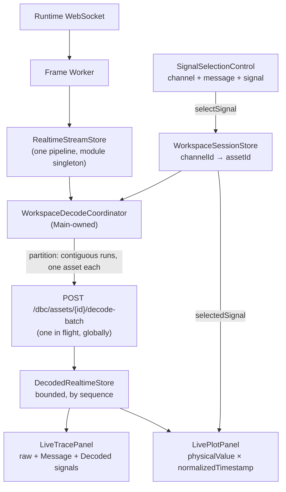

# V0.3-14 — Live DBC Decode, Trace & Plot Integration

> **Phase**: V0.3-14 — the last product phase of V0.3
> **Branch**: `feature/v0.3-14-live-dbc-decode-trace-plot-integration`
> **Base**: `origin/main` = `5ed3945450aff5099d5e6b4d40f59c4fcdac1bb0`
> **Status**: `CLOSED`
> **Final Acceptance**: `PASS` (round 2 — P0 0 · P1 0 · P2 0), project-owner / independent-reviewer
> verdict; provenance, protected integration and post-merge CI in §9. Round 1 returned `NOT PASS`
> (P0 0 · P1 3 · P2 0) and V0.3-14-FIX-1 closed all three findings (§7)

Written by the development agent. It records what was implemented and what was actually run; the
`PASS` recorded in §9 is the reviewer's verdict, not the agent's. Independent acceptance is external.

---

## 1. Objective

The phase connects the pieces V0.3-13 left adjacent but unwired — project open, DBC import, DBC
workspace, channel→asset binding, the Runtime decode-batch API and the realtime frame stream —
into one live engineering workflow: **Open Project → Import DBC → browse DBC → bind a channel to
an asset → frames arrive → the binding finds the asset → `decode-batch` → decoded values appear in
Trace beside the raw frame → the user explicitly picks channel + message + signal → Plot draws that
signal's physical value.**

The Runtime was not modified (`§6` of the phase brief: `NO Runtime change`), and the existing
`POST /dbc/assets/{asset_id}/decode-batch` contract was sufficient for the whole phase.



---

## 2. What was built

### 2.1 Shared contracts frozen before dispatch (Main Agent)

| Commit | Content |
|---|---|
| `a4b04f9` | `SignalSelection` hardened to a channel-bound identity (`workspace/session.ts`) |
| `502ea82` | `DecodedRealtimeStore` contract (`workspace/decoded-realtime.ts`) |
| `c631af9` | Runtime HTTP **transport extracted** to `runtime/runtime-http.ts` (§16): one origin, one 2xx/non-2xx split, one failure taxonomy — so the decode client re-uses rather than copies it. `dbc-client.ts` re-exports the three error types, so every existing consumer is unchanged. |
| `2428b19` | The phase's i18n key surface (`trace.column.message`, `trace.column.signals`, `trace.value.none`, `plot.title` re-worded, `plot.noSelection.*`, `plot.waiting`, `dbc.signal.plot`, `dbc.selection.*`); `plot.byte0` removed with the byte behaviour it named. |

Freezing the string surface before dispatch is what let three workers own disjoint files: none of
them had to touch `i18n/config.ts`.

### 2.2 The three workers (native-shared, pairwise C0)

| Task | Commit | Owned files |
|---|---|---|
| V0.3-14-A | `32d5e17` | `runtime/dbc-decode-client.{ts,test.ts}` |
| V0.3-14-B | `546e6af` | `components/trace/**` (4 files) |
| V0.3-14-C | `0519e18` | `components/plot/**`, `components/dbc/SignalSelectionControl.*` |

### 2.3 Main Agent integration

| Commit | Content |
|---|---|
| `80413d8` | `workspace/decode-partition.ts` (pure) + `workspace/decode-coordinator.ts` |
| `c92f1af` | Wire into `DockWorkspace.tsx`; `SignalSelectionControl` mounted in `DbcWorkspace.tsx` |
| `236e005` | End-to-end flows 1–8 |
| `a2771c0` | Task contracts, plan and handoffs (governance) |

---

## 3. The coordinator — the phase's critical algorithm

`partitionDecodeRuns(frames, assetForChannel, maxRunLength)` cuts a viewport into runs that are each
**one asset × contiguous sequence × ≤1000 frames**, because the Runtime's `FrameBatch.create()`
requires contiguity and an interleaved viewport cannot be sent as "all the `can0` frames".

```text
input:   1 can0→A   2 can1→B   3 can0→A   4 can0→A   5 can1→B
output:  A[1]       B[2]       A[3,4]              B[5]
NOT:     A[1,3,4]   B[2,5]        ← 1 → 3 is not contiguous; this is the bug the module prevents
```

A frame whose channel is unbound contributes no run **and ends the run in progress**: it occupies a
sequence number, so joining its neighbours would manufacture exactly that hole.

The coordinator that drives it holds seven properties (each covered by a test):

* **One request in flight, globally** — not per asset, not per viewport. A burst of snapshots
  becomes one further pass after the outstanding response lands.
* **Newest viewport wins** — the pass re-reads the current snapshot and current bindings; nothing is
  queued, so a slow Runtime cannot make the UI fall behind the bus.
* **A binding change is an epoch** — opening another project, binding, rebinding, unbinding or
  clearing advances a generation, clears the decoded store, and discards an in-flight answer.
* **A stream change is an epoch** — a new `streamId` forgets the processed set and resets the store.
* **Every answered frame is remembered, failures included** — otherwise one undecodable frame would
  be re-requested on every viewport update for the rest of the capture.
* **A request failure is not a frame failure** — recorded as `lastError`, clearing nothing; the same
  viewport is not retried in a tight loop against an unavailable Runtime.
* **Disposal is final** — `start()`'s unsubscribe detaches both subscriptions and advances the
  generation.

---

## 4. Tests

### 4.1 Counts (all from this session's tool output)

```text
before the phase            23 test files / 346 tests passed
after  the phase            31 test files / 461 tests passed        (+8 files, +115 tests)

worker focused suites (re-run by the Main Agent, not taken from worker reports)
  A  runtime/dbc-decode-client.test.ts                        1 file  /  36 tests
  B  components/trace                                         2 files /  15 tests
  C  components/plot + components/dbc/SignalSelectionControl   3 files /  24 tests
Main-owned
  workspace/decode-partition.test.ts                          8 tests
  workspace/decode-coordinator.test.ts                       13 tests
  workspace/live-decode-flows.integration.test.tsx           10 tests  (flows 1–8)
```

Test-count reconciliation: `+115` new, `−3` removed. The three removed are `buildByteSeries`'s own
byte-series tests in `components/plot/series.test.ts`; the function was deleted rather than left
unwired, because a pure function with no production caller is dead code. Its deterministic
reduction (even stride, first and last sample kept) is carried over verbatim into
`buildSignalSeries`, so the coverage was replaced rather than dropped. The panel's other
assertions moved from `getByText` to the existing `messageRow` helper, because the page now renders
each message name twice (the definition table and the selection control's option) — the assertions
are unchanged, only their locator is now unambiguous.

### 4.2 RED → GREEN observed, not asserted

* `decode-partition.test.ts` was written first and failed with `Failed to resolve import
  "./decode-partition"`; the implementation then made 8/8 pass.
* `decode-coordinator.test.ts` was written first and failed the same way; on first run against the
  implementation it produced **1 failed / 12 passed** — the coordinator completed a response and did
  not continue with the rest of the viewport. That is a real behavioural RED, and the fix
  (unconditional re-pass in `finally`, with `#inFlight` as the only serialisation) is what §57 asks
  for.
* `live-decode-flows.integration.test.tsx` first produced **2 failed / 8 passed** — the freeze flows
  could not find the Freeze control because the suite had not initialised i18n. Fixed by importing
  the shared config, exactly as the sibling panel suite does.

### 4.3 Mutation probes (all restored; every restore grep-verified)

| # | Mutation | Observed RED |
|---|---|---|
| 1 | drop the contiguity test from `partitionDecodeRuns` | 1 failed — "cuts a run when the sequence is not contiguous" |
| 1b | rewrite `partitionDecodeRuns` as group-by-assetId | **4 failed**, including "splits interleaved assets … never grouping by asset" |
| 2 | delete the generation check before `applyBatch` | 2 failed — the stale-project and the rebind flows |
| 3 | delete the in-flight guard in `#pump` | 1 failed — "keeps at most one request in flight" |
| 4 | plot `rawValue` instead of `physicalValue` | 6 failed — including "plots the decoded physical value …" |
| 5 | drop `frame.channelId !== selection.channelId` | 1 failed — "takes only the frames of the selected channel" |

Probes 4 and 5 were applied to the worker's file and reverted; `grep` confirmed the file contains
`signal.physicalValue` and the channel check at its original line before the commit.

---

## 5. Gates

```text
cd apps/desktop
pnpm typecheck   exit 0
pnpm lint        exit 0
pnpm test        exit 0   —  31 files / 461 tests passed
pnpm build       exit 0   —  built in 344ms

governance (native-shared, integration head a2771c01ee80b4a94221e4fb36e9ffde824c5b57)
validate-task     A exit 0 · B exit 0 · C exit 0
validate-handoff  A exit 0 · B exit 0 · C exit 0
check-integration A ready=true blockers=[] · B ready=true blockers=[] · C ready=true blockers=[]

GitHub CI  run 35431164004 · pull request #24 · head 7a62ae0 · conclusion success
  Change Classification   pass      59s
  Frontend / TypeScript   pass      1m42s
  Runtime / Python        pass      5m41s
  Desktop System / Rust   skipping  0s   — the change classifier found no src-tauri/** change, so
                                          the Rust job has nothing to build for this branch
  Quality Gate            pass      15s
```

These are the round-1 numbers. V0.3-14-FIX-1 then added commits to the same branch: its own local
gates are in §7.5, and its CI run is recorded on pull request #24.

### 5.1 Rendered check

The built bundle was served (`vite preview`, HTTP 200) and rendered headlessly. The workspace shell
mounts and the **Plot panel shows the new no-selection state** — `No signal selected` /
`Choose a channel and a signal in the DBC workspace.` — rather than the byte-0 curve it used to
draw. That is visual confirmation of §41 on a real render, not only in jsdom.

Runtime-unavailable and stream-disconnected indicators are expected in that environment: the page
was loaded without the Tauri sidecar, so there is no Runtime to reach. What this does **not**
verify is listed in §6.

---

## 6. Known limitations / NOT VERIFIED

```text
live Runtime sidecar decode-batch round trip        NOT VERIFIED — every decode assertion is against a stubbed transport
real virtual-CAN frames through decode → Plot      NOT VERIFIED — the frame source in tests is a snapshot pushed directly
Dockview panel-body layout end to end              NOT VERIFIED — jsdom performs no layout; the integration flows drive the
                                                   production object graph and mount LiveTracePanel directly
visual / pixel-level rendering of Trace's two new
  columns and the selection control                 NOT VERIFIED — only the Plot empty state was confirmed on a real render
Tauri desktop window (a real app run)              NOT VERIFIED
macOS / Linux                                      NOT VERIFIED — CI is windows-latest only
real CAN hardware                                  NOT VERIFIED
The Rust job on this branch                        SKIPPED by the change classifier — no
                                                   src-tauri/** file changed in this phase, so the
                                                   Rust job was not run rather than run and passed
```

Carried forward unchanged by this phase: `dbc/`-as-symlink rejection is skipped on Windows; the DBC
registry and filesystem cannot form a single transaction; the Desktop's DBC validation is
contract-shape validation, not a domain-semantics replica; timestamp segment pruning remains
disabled.

Recorded by the workers and accepted by the Main Agent as-is:

* **`trace.value.none` carries two meanings** — "no decode response yet" and "decoded, but the
  message declares no signals". Separating them needs a new i18n key, which the frozen surface does
  not have. Low impact, recorded.
* **Trace's eight column tracks are declared inline** in `TracePanel.tsx`, overriding the six-track
  `.trace-row` rule in `styles.css`. The rendered layout is correct (the inline declaration wins);
  the stylesheet rule is now a stale default rather than a second source of truth.
* **The echoed frame is compared across all sixteen fields.** Correct and fail-closed against the
  current Runtime, whose `Frame` is a frozen dataclass with no wire-round-trip normalization; it
  would refuse a legitimate response if that ever changed.

---

## 7. Independent acceptance round 1 — NOT PASS, and V0.3-14-FIX-1

**Verdict, recorded verbatim**: `Final Acceptance: NOT PASS` — `P0 = 0 · P1 = 3 · P2 = 0`. Source:
the project owner / independent reviewer, on reviewed head
`77b15519beeae9f5d9f23339b51a1417c9f447b7` (CI run `35431514089`, success). The verdict is the
reviewer's; this report only records it and what was done about it.

### 7.1 Findings and how each was closed

| Finding | Fix | Evidence |
|---|---|---|
| **P1-1** — the decode-batch client was not completely fail-closed: it enforced the size bound and the safe-integer sequence guard, but not request contiguity, the echoed `first_sequence` / `last_sequence`, or the full per-frame failure envelope | `requireContiguous` refuses a non-consecutive batch **before any request is built**; `readBatch` checks the summary against the submitted slice independently of the echoed frames; `readFailure` validates the whole `ErrorResponse` envelope before projecting only `code` | commit `d608495` · 18 new client tests · 3 mutation probes |
| **P1-2** — duplicate-suppression state (`#processed`) was unbounded: it grew for the life of the stream and was cleared only on an epoch change | `retainVisibleSequences` prunes markers whose frames have left the current viewport, so the state is bounded by the viewport rather than by the capture; `processedCount` added as a read-only diagnostic | commit `823e927` · 3 new coordinator tests incl. a 2 050-sequence sliding run · 1 mutation probe |
| **P1-3** — `PROJECT_STATE` reported a stale head, and its Deferred list still claimed implemented capabilities were deferred | head updated to the FIX product head; the three false entries removed and genuinely deferred capabilities recorded in their place | the documentation commit that carries this section |

### 7.2 P1-1 — the contract the client now enforces at its own boundary

```text
BEFORE any fetch
  1 <= frames.length <= 1000
  frames[i+1].sequence === frames[i].sequence + 1n         ← added
  every sequence survives as a JSON number                 (already present)

FROM the response
  schema_version === 1
  stream_id === submitted stream
  first_sequence === frames[0].sequence                    ← added
  last_sequence  === frames[last].sequence                 ← added
  frame_count === outcomes.length === frames.length
  outcome order matches submission; each echoed frame equals the frame submitted
  decoded XOR failure
  a failure is a structurally complete ErrorResponse       ← was code-only
  every signal: string name, integer raw_value, finite physical_value, nullable choice_label/unit
```

The client still does **not** decide channel→asset grouping — that is `partitionDecodeRuns`'s job.
What it now guarantees is that whatever it is handed is a canonical contiguous sequence, so a caller
that assembled frames by hand cannot slip a hole past the HTTP boundary.

### 7.3 P1-2 — the bound, stated the way the test states it

```text
viewport A         1 .. 20000        processed ⊇ 1..20000
viewport B     10001 .. 30000        processed becomes 10001..20000      (never 1..30000)

long-run test: 40 sliding windows of 100 frames at stride 50 → 2 050 distinct sequences pass
  observed (correct)   processedCount <= 100
  observed (mutation)  processedCount = 2050       → the assertion fails, naming the defect
```

Duplicate suppression is unchanged where it matters: an unchanged viewport is still decoded zero
times, and a per-frame failure still keeps its sequence marked while that frame is visible.

### 7.4 Mutation proof

| Mutation | Observed RED |
|---|---|
| remove `requireContiguous` | 3 failed — the hole, the gap and the descending batch |
| remove the `first_sequence` / `last_sequence` check | 5 failed — four summary mismatches plus the multi-frame contradiction |
| reduce `readFailure` to `code` only | 5 failed — missing message, missing details, array details, string recoverable, missing source |
| remove the viewport pruning of `#processed` | 2 failed — `expected 10 to be less than or equal to 5` and `expected 2050 to be less than or equal to 100` |

All four were restored; the restores were verified by re-running the suites and, for the three
product-side guards, by `grep` on the source.

### 7.5 Gates after V0.3-14-FIX-1

```text
cd apps/desktop
pnpm test        exit 0  —  31 files / 482 tests passed   (461 before FIX-1; +21 tests, none removed)
pnpm typecheck   exit 0
pnpm lint        exit 0
pnpm build       exit 0
```

Governance is unchanged: the A/B/C task contracts and handoffs are frozen history and remain valid.
This FIX is Main-Agent-owned work inside the same two modules those workers delivered, added after
their delivery ranges closed, so it falls outside their ownership ranges rather than rewriting them.
No historical handoff was edited.

## 8. Developer status

```text
V0.3-14         IMPLEMENTED · SELF-VERIFIED · AWAITING INDEPENDENT RE-ACCEPTANCE
V0.3-14-FIX-1   IMPLEMENTED · SELF-VERIFIED · AWAITING INDEPENDENT RE-ACCEPTANCE

Final Acceptance: NOT CLAIMED
Status:           NOT CLAIMED
V0.3-FINAL:       NOT STARTED
```

The pull request was left **OPEN** at that time. No merge, no verdict, and no milestone statement is
made by this section.

> §8 records the developer status **as it stood when the branch was handed over**. It is preserved
> unedited. §9 is what actually happened to it: independent acceptance round 2 and the protected
> integration that closed the phase.

---

## 9. Independent acceptance round 2 — PASS, and protected integration

### 9.1 Round 2 verdict

**Verdict, recorded verbatim**: `Final Acceptance: PASS` — `P0 = 0 · P1 = 0 · P2 = 0`.

**Acceptance source**: project owner / independent reviewer, external acceptance conversation. The
verdict was reached on the V0.3-14-FIX-1 product head (reviewed head
`77b15519beeae9f5d9f23339b51a1417c9f447b7` at round 1, then the fix head
`823e92764924368170e8cf11f9400ff8a6dfa583`, with `a10d760` carrying the documentation/current-truth
commit). The verdict is the reviewer's; this report only records it.

**GitHub Review artifact**: **None.** Pull request #24's review list is empty at closeout time —
`GET /repos/yjw17694927050-art/CAN-X/pulls/24/reviews` → `[]`. The verdict's provenance is the
external acceptance conversation stated above, not a review artifact in this repository. No review
artifact is claimed to exist.

### 9.2 The FIX commits this PASS rests on

| Commit | Content |
|---|---|
| `d608495` | **decode contract** — `requireContiguous` before any request is built; `readBatch` checks the echoed `first_sequence` / `last_sequence` / `frame_count` against the submitted slice; `readFailure` validates the whole five-field `ErrorResponse` envelope before projecting `code` (§7.2) |
| `823e927` | **bounded duplicate suppression** — `retainVisibleSequences` prunes markers whose frames have left the current viewport, so `#processed` is bounded by the viewport instead of by the capture (§7.3) |
| `a10d760` | **documentation / current truth** — the round-1 verdict recorded, the three findings closed in the truth surface, `PROJECT_STATE` head and Deferred list corrected (§7.1, P1-3) |

### 9.3 Protected integration

```text
PR number                #24 — V0.3-14 — Live DBC Decode, Trace & Plot Integration
accepted head            a10d760ef34985a478e2402e4e372db5be02f1d9
base                     main 5ed3945450aff5099d5e6b4d40f59c4fcdac1bb0 (the V0.3-13 closeout lineage)
github mergeability      mergeable = MERGEABLE · mergeStateStatus = CLEAN
head CI (pre-merge)      35432324500 — SUCCESS (Change Classification pass · Runtime / Python pass ·
                         Frontend / TypeScript pass · Desktop System / Rust skipping · Quality Gate pass)
merge method             merge commit
merge commit SHA         14fd38de99ecb203cdc2a3c285a5a699c938b955
bypass used              NO   — the ruleset main-protected-integration (23600372) declares
                                bypass_actors: [] and none was added
ruleset modification     NO   — updated_at unchanged at 2026-09-17T21:20:48.599+08:00; enforcement active
accepted head is an ancestor of the new origin/main   VERIFIED
  (git merge-base --is-ancestor a10d760… origin/main → true, after 5ed3945..14fd38d on main)
```

No direct push to `main`, no admin bypass, no ruleset weakening, no force push and no required-check
removal was used — the merge went through the repository's normal protected PR path.

### 9.4 Post-merge main CI

```text
run ID          35434232483   (event: push → main, headSha 14fd38de99ecb203cdc2a3c285a5a699c938b955)
Change Classification   SUCCESS   classification = runtime+frontend,
                                  runtime_required true · frontend_required true ·
                                  rust_required false · full_required false
Runtime / Python        SUCCESS
Frontend / TypeScript   SUCCESS
Desktop System / Rust   skipping  — legitimate classifier routing: no src-tauri/** file is in this
                                  diff, so rust_required is false. Skipped by routing, not failed.
Quality Gate            SUCCESS   — evaluated the aggregate with `if: always()`
```

### 9.5 Phase state

```text
V0.3-14
  Final Acceptance: PASS
  Status:           CLOSED

V0.3-FINAL
  READY TO START
  NOT STARTED
```

No version-level completion is declared: V0.3 has one phase left to run, and closing a phase does
not close the version. Version closure is an independent reviewer / project-owner decision.

