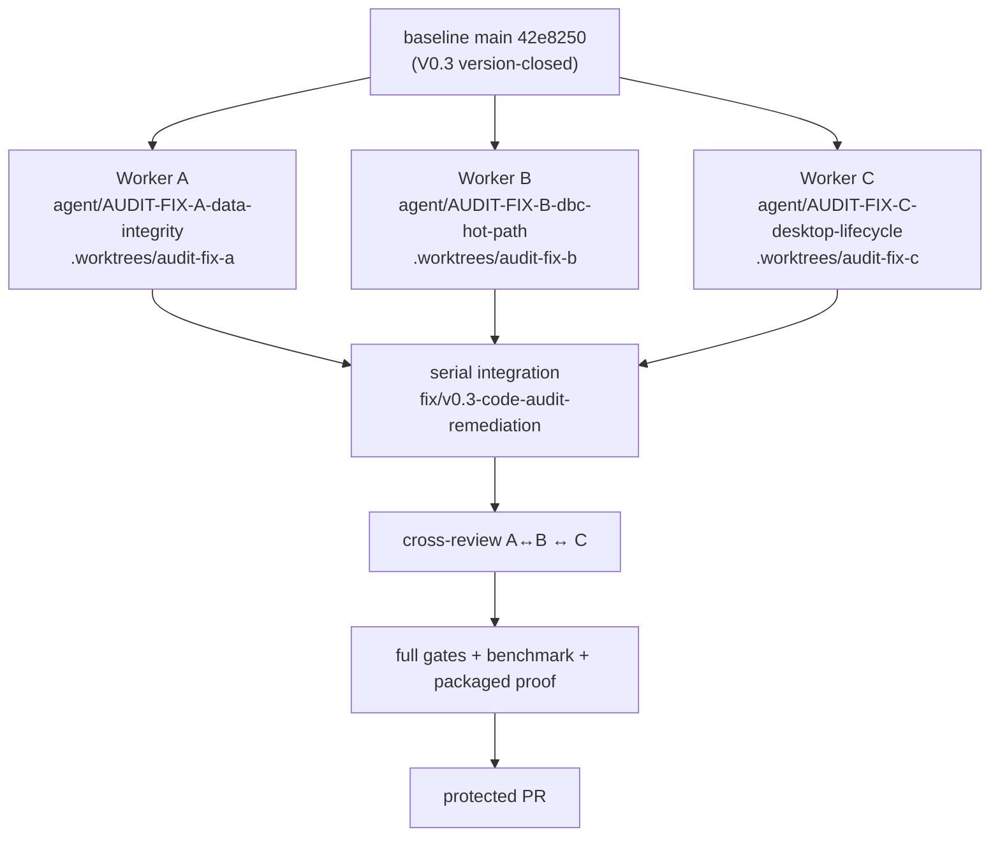

# V0.3-CODE-AUDIT Remediation — Evidence Report

> **Phase**: V0.3-CODE-AUDIT REMEDIATION SPRINT (maintenance / qualification, **not** a product phase)
> **Baseline**: `42e8250ce23192a931466ba84d4685967e6cd0e2` — the V0.3 version-closed `main`
> **Branch**: `fix/v0.3-code-audit-remediation`
> **Status**: `IMPLEMENTED · SELF-VERIFIED · AWAITING INDEPENDENT ACCEPTANCE`
> **Final Acceptance**: NOT CLAIMED

Written by the Main Agent of the remediation sprint. It records what was changed and what was actually
run. It grants no verdict: the independent V0.3-CODE-AUDIT returned `REMEDIATION REQUIRED`, and whether
that verdict is now discharged is for the independent reviewer to decide.

---

## 1. What this sprint is

The independent V0.3-CODE-AUDIT found **no P0** and returned **5 fix groups** to be closed before V0.4.
This sprint closes them under a multi-agent division of labour with serial integration. It adds **no
product capability**: no V0.4 feature, no UDS / J1939 / DoIP, no real TX, no DBC editor, no Replay, no
plot feature, no UI redesign, no schema migration.



---

## 2. Execution topology, ownership and commits

**1 Main Agent + 3 Sub-Agents.** Because the host harness runs its default **shared-worktree** mode
(measured in the AGENT-02 pilot and recorded in `docs/ADR/0003-…`), each worker was given its own real
Git worktree and branch instead, so three concurrent writers could not share one index. Each workstream
was bounded by a machine-readable TaskContract in `.agent/tasks/AUDIT-FIX-*.json`, each validated with
`tools/agent/cli.py validate-task` (`status: ok`).

```text
workstream  branch                                worktree              worker commit(s)
A           agent/AUDIT-FIX-A-data-integrity      .worktrees/audit-fix-a   d4ba695
B           agent/AUDIT-FIX-B-dbc-hot-path        .worktrees/audit-fix-b   217cbaf · 0bfea5e
C           agent/AUDIT-FIX-C-desktop-lifecycle   .worktrees/audit-fix-c   09ef970
```

| Workstream | Surface (allowed_paths) | Forbidden, and enforced |
|---|---|---|
| A — data integrity | `runtime/canx/data/**`, `runtime/canx/query/**`, the owning unit/integration tests | `runtime/canx/domain/**`, `recorder/**`, `api/**`, `apps/**`, `docs/**` |
| B — DBC hot path | `runtime/canx/dbc/**`, `runtime/canx/api/dbc.py`, DBC tests, the workspace decode modules | `domain/**`, `data/**`, `query/**`, `safety/**`, `api/project.py`, `api/app.py`, Desktop runtime + components |
| C — desktop lifecycle | `apps/desktop/src/runtime/**`, `components/workspace/**`, `components/plot/**`, `workers/**`, `i18n/**` | `apps/desktop/src/workspace/**` (B's), `runtime/**`, `vite.config.ts`, `package.json`, lockfiles |

The three surfaces are disjoint, so all three merged **without a single conflict**:

```text
5fe1308  merge agent/AUDIT-FIX-A-data-integrity     → fix/v0.3-code-audit-remediation
352e8c8  merge agent/AUDIT-FIX-B-dbc-hot-path
a14fceb  merge agent/AUDIT-FIX-C-desktop-lifecycle
90733ac  chore(agent): the three task contracts
```

Two governance notes, recorded rather than smoothed over:

* `runtime/canx/domain/**` and `runtime/canx/api/**` are `public_truth_paths` in `.agent/config.json`
  (`INTEGRATION_POLICY.md` §17.2: protected from *parallel* writers). The audit brief listed
  `domain/frame.py` and `domain/batch.py` among the "likely" files for workstream A. Premise checking
  showed A needed **no** change there at all — every fix landed in `runtime/canx/data/session.py` and
  `runtime/canx/query/service.py` — so no public-truth path was touched by a parallel worker. B is the
  only writer of `api/dbc.py`, and that file is listed in its handed-off surface and singled out for
  Main-Agent review (§4.3).
* The merge chain is a **merge-commit chain, not a rebase**, so every worker commit stays reachable and
  attributable.

---

## 3. The five findings — before and after

### 3.1 AUDIT-FIX-01 — sequence continuity (workstream A)

**Before.** `DataSessionWriter._require_contiguous_sequence` (`runtime/canx/data/session.py:317-329`)
returned early on the first batch and then rejected only `batch.first_sequence <=
self._last_appended_sequence`. A **positive gap** — the batch starting at `last + 2` or beyond — was
silently accepted and persisted, so a session could record `first_sequence = 0`, `last_sequence = 6`,
`frame_count = 5` with the hole invisible in every stored number. The only `+1` guard lived in the
recorder (`runtime/canx/recorder/project_recorder.py:363-383`, `recorder.sequence_gap`), which any
direct `DataSessionService` caller bypasses.

**After.** The writer requires exactly `first_sequence == previous_last_sequence + 1` once frames have
been appended; the **first** batch is exempt and may start at any legal sequence (that was already true
and stays true). Gap, regression and overlap are one defect ("the batch does not continue this
session's sequence"), reported with the existing `data.integrity.sequence_regression` code and told
apart by details that carry both the observed and the expected next sequence.

**Evidence.**

```text
RED (old code restored byte-for-byte from d4ba695^, md5 7dbb49c902c231a59c3babdb736b1583):
  pytest -q tests/unit/data/test_writer_sequence_continuity.py tests/unit/data/test_writer_timestamp_monotonicity.py
  → 12 failed, 14 passed    ("Failed: DID NOT RAISE DataIntegrityError")
GREEN (restored, md5 17fc07b9e07f7d4c95bddf2e4d478ccb):
  → 46 passed
```

`ProjectRecorder`'s `recorder.sequence_gap` gate was **not** removed or changed: this is
defence-in-depth, and the writer is now correct alone.

### 3.2 AUDIT-FIX-02 — timestamp monotonicity (workstream A)

**Before.** `_require_ordered_timestamps` compared only `frames[0]` and `frames[-1]` (and one
cross-batch pair), all with a strict `<`. `1.0, 3.0, 2.0, 4.0` therefore passed and was persisted, so
reading the session back in sequence order produced a descending series.

**After.** Every adjacent pair is compared, **inside** the batch and **across** the batch boundary.
**Equality remains legal** — `runtime/canx/domain/frame.py` and `domain/batch.py` impose no ordering,
and equal consecutive timestamps are permitted by that contract — and two tests lock that
(`test_equal_consecutive_timestamps_stay_legal_within_a_batch`,
`test_equal_timestamps_across_a_batch_boundary_stay_legal`). The change is deliberately non-decreasing,
never strictly-increasing.

### 3.3 AUDIT-FIX-03 — the live DBC decode hot path (workstream B)

**Before, measured.** Per decode request, `_decode_one` and `_decode_batch` (`runtime/canx/api/dbc.py`)
each called `ProjectDbcService(...).load_asset(asset_id)` and then compiled a **new** `DbcDecoder`.
`load_asset` opened the project (a SQLite connection), opened a **second** connection for the registry
row, read the `.dbc` bytes, verified size and SHA-256 (hashing the same bytes a second time when
building the provenance record), decoded the text, parsed with `cantools`, converted to the canonical
model — and then the decoder compiled one `_MessagePlan` per message. A split measurement on a
300-message / 2400-signal synthetic DBC put the per-request static cost at **~189 ms `load_asset` +
~5.2 ms decoder compile**, against **~0.22 ms** for read + SHA-256. No cache existed anywhere in
`runtime/canx/dbc/**`.

The per-request reload was documented as *deliberate* (`runtime/canx/api/dbc.py:36-40, 657-663`:
"no cached current DBC"). The change therefore had to preserve that intent, not merely contradict it.

**After.** `runtime/canx/dbc/decoder_cache.py` adds a bounded LRU of **compiled decoders** keyed on
**verified content identity** — `DecoderKey(project_id, sha256, size_bytes, encoding)` — and
`ProjectDbcService.load_decoder` checks it. Four properties are deliberate and each closes a way the
cache could go wrong:

```text
key = content identity, not a name   a replaced file cannot reuse an entry; two projects with equal
                                     bytes are two entries (project_id is a persisted project UUID,
                                     not a path)
integrity is checked BEFORE the cache, never by it
                                     read_verified_asset still reads and hashes on every request; a
                                     cache hit skips PARSING, never VERIFYING, so a tampered asset
                                     can neither populate nor hit an entry
no cross-project reach               there is no ambient "current DBC": an entry is only reached by
                                     presenting that asset's verified identity
bounded, LRU                         DEFAULT_MAX_ENTRIES = 8, evicted least-recently-used first
```

The two docstrings that declared the old contract were updated to state the new one accurately, and no
now-false comment survives (`grep -i 'per request|never cached|recompil' runtime/canx/api/dbc.py`
returns only the new, correct line).

**Benchmark — real numbers, one machine, one run.** The harness at
`tests/unit/dbc/bench_dbc_hot_path.py` drives a real project and a real imported asset through the real
`_decode_batch` path and runs **both** modes in the same process, so the comparison is not a
cross-commit guess.

```text
environment: Windows 11 (AMD64), Python 3.13.15, 16 CPUs        total wall time: 42.98s
command:     PYTHONPATH=$PWD/runtime .venv/Scripts/python.exe tests/unit/dbc/bench_dbc_hot_path.py
```

*Project: large (synthetic — 300 messages / 2400 signals)*

| scenario | mode | req | frames | ms/req | frames/s | parse | compile |
|---|---|---:|---:|---:|---:|---:|---:|
| 1-one-channel | cache | 20 | 400 | **13.69** | 1 461 | **1** | **1** |
| 1-one-channel | no-cache | 20 | 400 | 193.88 | 103 | 20 | 20 |
| 2-shared-dbc | cache | 20 | 400 | **14.40** | 1 389 | **1** | **1** |
| 2-shared-dbc | no-cache | 20 | 400 | 195.45 | 102 | 20 | 20 |
| 3-two-dbc | cache | 20 | 200 | **12.63** | 792 | **1** | **1** |
| 3-two-dbc | no-cache | 20 | 200 | 200.26 | 50 | 20 | 20 |
| 4-worst-case | cache | 40 | 40 | **7.86** | 127 | **1** | **1** |
| 4-worst-case | no-cache | 40 | 40 | 216.65 | 5 | 40 | 40 |
| 5-large-batch | cache | 10 | 10 000 | **76.49** | 13 073 | **1** | **1** |
| 5-large-batch | no-cache | 10 | 10 000 | 254.49 | 3 929 | 10 | 10 |
| 6-repeat-small | cache | 20 | 20 | **15.19** | 66 | **1** | **1** |
| 6-repeat-small | no-cache | 20 | 20 | 207.22 | 5 | 20 | 20 |

Parse and compile counts fall from *once per request* to *once per asset* — that is the finding,
stated as a count rather than as an impression. Per-request latency falls between **13×** (one channel)
and **27×** (worst-case alternating channels).

*Project: small (the 134–405 byte `tests/fixtures/dbc` files)* — reported honestly as a **partial win**:

| scenario | mode | ms/req | frames/s | parse | compile |
|---|---|---:|---:|---:|---:|
| 1-one-channel | cache | 4.05 | 4 943 | 2 | 2 |
| 1-one-channel | no-cache | 4.64 | 4 312 | 200 | 200 |
| 4-worst-case | cache | 3.09 | 323 | 2 | 2 |
| 4-worst-case | no-cache | 3.89 | 257 | 400 | 400 |
| 5-large-batch | cache | 42.06 | 23 774 | 2 | 2 |
| 5-large-batch | no-cache | 42.94 | 23 289 | 50 | 50 |
| 6-repeat-small | cache | 3.24 | 309 | 2 | 2 |
| 6-repeat-small | no-cache | 3.89 | 257 | 200 | 200 |

On ~300-byte fixtures the wall-clock gain is small (a few percent to ~17 %) because project open
(SQLite) + read + SHA-256 dominate a tiny parse. The parse/compile counters still collapse from 200 to
2 — the repetition is gone, the total is just no longer parse-bound. **No scenario is worse.**

**Tamper / isolation proof.** A project-owned `.dbc` modified on disk after a successful decode still
fails closed with `dbc.asset_integrity_failed` (`recoverable=False`) instead of being served from the
cache; a tampered asset is refused *before* the cache is consulted. Two projects holding identical
bytes remain two entries. Evidence: `tests/unit/dbc/test_dbc_decoder_cache.py` (11) and
`tests/unit/dbc/test_dbc_decode_hot_path.py` (5), including
`test_a_tampered_asset_is_refused_after_a_successful_decode`.

### 3.4 AUDIT-FIX-04 — realtime reconnect (workstream C)

**Before.** `realtime-stream.ts` had five states and no retry at all: `onclose` and `onerror` both
patched `connection: "closed"` and **never released** the worker or the socket, so the `#connect` gate
(`if (this.#worker !== null || this.#socket !== null) return;`) permanently blocked any re-attempt while
a subscriber existed. There was no `worker.onerror`, no backoff, and no identity guard, so a late event
from a superseded socket could overwrite newer state.

**After.** An explicit, bounded machine: `idle · connecting · open · retrying · closed · unsupported`,
with `RETRY_DELAYS_MS = [250, 500, 1000, 2000, 4000]`, a generation counter guarding every handler, a
worker error path, an atomic-init guard that tears down whichever half was created if the other is
unavailable, and a `dispose()` that releases both. A failing pair is released (references nulled,
generation advanced, socket closed, worker terminated) **before** the retry timer is scheduled, so a
reconnect cannot leave two store-owned pipelines. Still exactly one `new WebSocket(` and one
`new Worker(` in production code.

**RED→GREEN:** the suite went from 8 tests to 16, with **10 failing before** the implementation
(`waiting is not increasing`, retry cadence, a superseded socket's late event, reconnect after dispose,
worker error, in-band error, epoch not resurrected) and 16 passing after.

### 3.5 AUDIT-FIX-05 — capture ownership, transport floor, Dockview, Plot resize (workstream C)

**Capture ownership — before.** `DockWorkspace.tsx:112-123` owned the capture with a closure boolean
inside a fire-and-forget effect (`let ownsCapture = false; void startVirtualCapture(); … if
(ownsCapture) void stopCapture(); }, []);`). Three ordering failures were reproducible: an answer
arriving after unmount left a started capture that nothing would stop; a StrictMode replay POSTed a
second start; and `stopCapture`'s rejection was dropped. **After:** `capture-lifecycle.ts` expresses
*intent* (`wanted`) and reconciles it against its own phase (`idle · starting · owned · observed ·
stopping · failed`), re-reading that intent after every `await`, so a late answer is still resolved
correctly; attaching is not owning (`capture.already_running` is observed, never owned), and a failed
stop is recorded rather than dropped. RED: 4 failed / 2 passed before wiring; GREEN after.

**Transport floor — before, measured.** `runtime-http.ts` already shared the base URL, the three error
types, `runtimeFetch`, `readResponse` (including the transport-versus-contract split) and the envelope
reader. The audit text described `capture-client` / `project-client` / `dbc-client` as **all** carrying
their own copy; the measurement narrowed that: `project-client` genuinely duplicated all of it,
`capture-client` partially duplicated it and was *weaker* (a bare `Error`, no split at all), while
`dbc-client` and `dbc-decode-client` already routed through the floor and `runtime-client` sends no
HTTP. **After:** both remaining clients use the one floor, each endpoint keeps its own payload
validation and wire→model mapping, and no endpoint validation was lost.

**Dockview — before.** The layout effect's dependency array was `[t, queryClient, store, decodedStore]`
with `t` from `useTranslation()`. Measured: a language change built a **second** `createDockview` and
disposed the first, recreating every panel and tearing down the Trace/Plot roots that hold the realtime
subscription. **After:** the layout effect depends only on structural identities and reads the current
translator through a ref, while a separate effect retitles the panels that were kept.

**Plot resize — before.** No resize handling existed anywhere in `LivePlotPanel.tsx`. **After:** an
explicit `ResizeObserver` drives the chart, with clean unmount, race-safe dynamic import, safe dispose of
a never-initialised chart, repeated-resize safety and no leaked observer. Two of the three new resize
tests were shown to be real regression tests by a mutation probe (removing the observer turns them red);
the third passes either way and is recorded as such.

---

## 4. Review, integration and what the review actually caught

### 4.1 Serial integration

Integration was strictly serial, one branch at a time, with the owning tests re-run after each merge —
never three merges and then one test run:

```text
after A   502 passed   (tests/unit/data, tests/unit/query, tests/unit/recorder,
                        test_query_id_filters.py, test_query_timestamp_regression.py)
after B   601 passed, 1 skipped   (tests/unit/dbc, test_dbc_api_integration.py)
after C   frontend 33 files passed; lint · typecheck · build all exit 0
```

Two existing integration fixtures had to be migrated by A, because tightening the writer legitimately
invalidated the behaviour they were written around. The migration was reviewed line by line: in
`tests/integration/test_query_id_filters.py` the witness frames were renumbered from a sparse sequence
space (`10, 20, … 99`) into a contiguous one (`0…7`) with `sequence_end` 90 → 6, and the assertions keep
their exact structure (`assert combined == [0, 1]` was `[10, 20]`; every
`set(relaxed[axis]) == {*combined, witness}` is unchanged). In
`tests/integration/test_query_timestamp_regression.py` the non-monotonic segment is still committed, but
through the Parquet writer and repository the earlier version used. **No assertion was deleted or
weakened**; two docstrings that documented the old permissive rule were corrected.

### 4.2 Cross-review (round 2)

| Reviewer | Question | Verdict |
|---|---|---|
| A ↔ B | does the decoder cache break the persistence/identity invariants A enforced? | **NO CONFLICT** — the decode path imports neither `canx.data` nor `canx.query`, so it cannot bypass `require_registered_segment`, the sequence rule or the timestamp rule; `DecoderKey.project_id` is a persisted project UUID, not a path |
| B ↔ C | does the Desktop rewrite leave the DBC decode authority unique and the pipeline single? | **NO CONFLICT** — one WebSocket, one Worker, one `realtimeStream` singleton, one coordinator and one decoded store per mount; the stream-epoch reset survives; capture touches no decode state; the transport floor is shared with endpoint validation retained |
| C ↔ A | can the Desktop still consume what the Runtime returns? | shape comparison consistent and the Desktop has **no** `/trace/query` caller and **no** session/segment/Parquet write path — but the reviewer **withdrew its own `NO BREAK` verdict** as unverified, because it could not execute anything |

### 4.3 What the Main-Agent review caught

Three things went wrong in the workers' runs. All three are recorded because the sprint's evidence is
only worth what its review is worth.

**a. Worker C's C4 fix was built on a false premise, and its own measurement test caught it.** C asserted
that `useTranslation()`'s `i18n` is "the stable identity and `t` is not". Its own committed test failed on
its final state (`expected [...] to have a length of 1 but got 2`), and it said so honestly. The Main
Agent then **measured** the premise with a temporary probe (since deleted):

```text
PROBE_RESULT {"renders":2,"instanceStable":false,"translatorStable":false,"readyStable":true,
              "instanceIsModuleInstance":false}
```

`i18n` is **not** stable across a language change, and it is not the module instance either — so an
`i18n` dependency re-runs the layout effect exactly as `t` did. The layout effect now depends only on
structural identities and reads the translator through a ref. The Main Agent made this fix, re-ran the
frontend gates (33 files green, lint / typecheck / build clean) and committed it in `09ef970` with the
attribution in the commit message.

**b. The Main Agent made a false negative about Worker A, and A refuted it with evidence.** A shell check
of A's worktree returned a clean `git status` and an empty `git log <base>..HEAD`; the Main Agent read
that as "A produced nothing" and put that claim into A's resume brief. It was wrong: `d4ba695` **is**
A's HEAD (`git rev-list --count 42e8250..HEAD` → 1), and the clean status meant the work had been
**committed**, not that it was absent. A's resume replied with the physical evidence and correctly
refused to redo the work, then independently reproduced the RED by restoring the pre-fix file
byte-for-byte and checking the md5 on the way back. The lesson is recorded here rather than buried: the
Main Agent's own observation was lossy (a truncated `git log` plus an empty status) and the negative
conclusion drawn from it was unsupported.

**c. The reviewers' own verdicts are not evidence.** Two of the three cross-review verdicts were produced
without executing anything, and the third was the one that withdrew its verdict. Every claim in this
report that matters is backed by a command with an exit code in §3 and §5; the cross-review is recorded
as *reasoning about the code*, not as proof.

---

## 5. Final gates on the integrated tree

```text
Runtime / Python
  ruff    check runtime tests tools                       All checks passed!            exit 0
  mypy    runtime tools/agent tools/ci                    Success: no issues found in 99 source files   exit 0
  pytest  -q                                              2859 passed, 1 skipped        exit 0

Frontend / TypeScript
  lint                                                     exit 0
  typecheck                                                exit 0
  test                                                     33 files passed               exit 0
  build                                                    built in 436 ms               exit 0

Baseline for comparison, measured the same way on 42e8250:
  pytest 2795 passed, 1 skipped  ·  frontend 31 files / 482 tests
```

The single skip is the pre-existing Windows symlink-privilege skip
(`tests/unit/dbc/test_dbc_asset.py:274`, `WinError 1314`), unchanged by this sprint. Test counts grew
from 2796 to 2860 collected (+64) and from 31/482 to 33/513 frontend (+31 tests across five files),
every increase explained by a new test file or a new case. **No test was skipped, weakened or deleted.**

### 5.1 Packaged proof — rebuilt, not reused

Worker B found something that would otherwise have made this evidence worthless: the staged sidecar
predated the change (`grep -a -c decoder_cache build/runtime-dist/canx-runtime.exe` → **0**), so running
the packaged smoke against it would have "passed" while proving nothing about the new code. The sidecar
was therefore **rebuilt from the integrated tree** before the proof:

```text
scripts\build-runtime.cmd                              exit 0
  → build/runtime-dist/canx-runtime.exe   60,238,133 bytes   (rebuilt 2026-09-19 20:15)
pytest -q tests/integration/test_packaged_runtime_smoke.py
  → 7 passed in 29.37s
```

That suite drives the frozen executable over real HTTP through open-project → import → decode →
decode-batch → tamper → 409, so the cache is exercised inside the shipped image, not only in the source
tree.

---

## 6. Residual, deferred and unverified

```text
P0                    0
P1                    0
new P2 found          none

carried forward, unchanged by this sprint:
  pnpm tauri dev port mismatch    P2 — ACCEPTED NON-BLOCKING at V0.3-FINAL; still NOT fixed.
                                  apps/desktop/vite.config.ts is untouched by this sprint, which is
                                  a code sprint but not a licence to widen its own scope.
  /trace/query documented but
    has no Desktop consumer       OBSERVED by cross-review, NOT INVESTIGATED. docs/PROJECT_STATE.md
                                  lists the endpoint; the Desktop has no caller. Whether that is
                                  deliberate (Runtime-first API) or drift is for the code audit to
                                  settle. No claim is made either way.
  stream epoch keyed on stream_id decode-coordinator.ts:170 resets on a stream_id CHANGE. A reconnect
                                  that yields the SAME stream_id deliberately does not reset the decoded
                                  store — matching the stated requirement, and recorded here as a sharp
                                  edge rather than a defect.

NOT VERIFIED
  macOS / Linux                  CI is windows-latest only
  real CAN hardware              none attached
  real CAN TX                    no TX path exists in this tree
  the whole virtual-CAN → decode → Plot chain in one automated run across the process boundary
  wheel-level visual rendering of the new retry state in a real Tauri webview
```

---

## 7. Changed files

```text
runtime/canx/data/session.py                     sequence + timestamp invariants; the shared
                                                 require_registered_segment gate
runtime/canx/query/service.py                    calls the shared gate instead of its own check
runtime/canx/dbc/decoder_cache.py                NEW — bounded LRU keyed on verified content identity
runtime/canx/dbc/project_service.py              read_verified_asset + load_decoder
runtime/canx/api/dbc.py                          decode paths use load_decoder; docstrings corrected

apps/desktop/src/runtime/realtime-stream.ts      bounded reconnect lifecycle
apps/desktop/src/runtime/capture-lifecycle.ts    NEW — explicit capture ownership
apps/desktop/src/runtime/capture-client.ts       shares the transport floor
apps/desktop/src/runtime/project-client.ts       shares the transport floor
apps/desktop/src/components/workspace/DockWorkspace.tsx   capture wiring; layout decoupled from i18n
apps/desktop/src/components/plot/LivePlotPanel.tsx        ResizeObserver lifecycle
apps/desktop/src/i18n/config.ts                  the new stream.retrying key

tests/                                          4 new data/query suites, 3 new DBC suites (incl. the
                                                 benchmark harness), 2 new frontend suites, plus the
                                                 migrated fixtures and extended existing suites
.agent/tasks/AUDIT-FIX-{A,B,C}.json              the three ownership contracts
docs/acceptance/v0.3-code-audit-remediation.md   this report
docs/PROJECT_STATE.md                            the remediation section
```

No product capability, no new endpoint, no new parameter, no schema change, no SQLite migration, no
dependency change, no CI-semantics change.

---

## 8. Developer status

```text
V0.3-CODE-AUDIT REMEDIATION:  READY FOR INDEPENDENT ACCEPTANCE

V0.3-CODE-AUDIT:              NOT self-closed
V0.4:                         NOT STARTED
```

The five findings are implemented and self-verified against the evidence above. Whether the audit's
`REMEDIATION REQUIRED` is discharged is the independent reviewer's verdict, not this document's.
