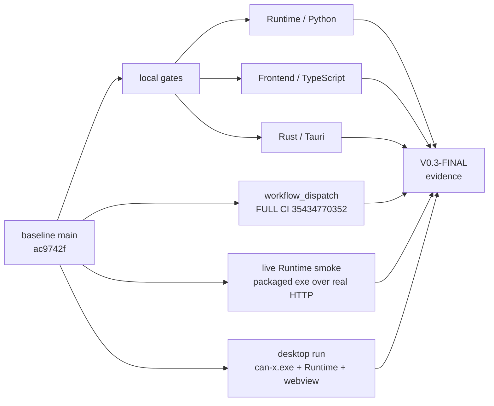

# V0.3-FINAL — Full Regression, Integration & Version Closure Evidence

> **Phase**: V0.3-FINAL — V0.3's last quality gate
> **Baseline**: `V0_3_FINAL_BASE_SHA` = `ac9742f2097e2c0f6ad5c0a75c7e346c75a209ae`
> **Evidence branch**: `docs/v0.3-final-full-regression` — PR #26, merged (§16)
> **Status**: `CLOSED`
> **Final Acceptance**: `PASS` — project-owner / independent-reviewer verdict; source and
> provenance in §16
> **V0.3 Version Acceptance**: `PASS` · **Status: CLOSED**

§1–§15 were written by the development agent before the verdict, and are preserved as they stood.
Every number in them comes from a command run in that session and is quoted from that command's
output. §16 records the independent acceptance and the protected integration. The verdict is
external; the development agent did not grant it.

---

## 1. What this phase was asked, and what it is not

V0.3-FINAL asks one question: **can the whole V0.3 product on `main` be closed as one complete,
internally consistent, runnable version?** It is not a development phase. No product capability was
added: no new Runtime API, no new DBC / Trace / Plot feature, no new Agent tool, no TX, no device
management, no CD, installer, cloud, account or license work.

What this phase did add to the repository is evidence and one test-only harness:

```text
docs/acceptance/v0.3-final.md                       this file
tests/integration/test_packaged_runtime_smoke.py    +1 test (live decode-batch envelope)
docs/PROJECT_STATE.md                               current truth refresh
```

The one product-code-adjacent finding (a defective developer command, §9) was **not** fixed. §28 of
the brief — no silent repair — is why it is reported here instead.



---

## 2. Baseline — what V0.3-FINAL started from

### 2.1 V0.3-14 was integrated and closed first (Part A)

```text
round 1 verdict          Final Acceptance: NOT PASS   P0 0 · P1 3 · P2 0
                         reviewed head 77b15519beeae9f5d9f23339b51a1417c9f447b7
V0.3-14-FIX-1            d608495  the decode-batch request/response contract at the client boundary
                         823e927  duplicate suppression bounded by the viewport
                         a10d760  documentation / current truth
round 2 verdict          Final Acceptance: PASS        P0 0 · P1 0 · P2 0
                         source: project owner / independent reviewer,
                         external acceptance conversation
                         GitHub Review artifact: NONE — PR #24's review list is empty (`[]`)
```

Head guard, then protected integration of PR #24:

```text
PR                        #24
accepted head             a10d760ef34985a478e2402e4e372db5be02f1d9
base                      main 5ed3945450aff5099d5e6b4d40f59c4fcdac1bb0 (the V0.3-13 closeout)
mergeability              MERGEABLE · CLEAN
head CI                   35432324500 SUCCESS (classification runtime+frontend;
                          Desktop System / Rust skipping — rust_required false)
merge method              merge commit
merge commit              14fd38de99ecb203cdc2a3c285a5a699c938b955
bypass used               NO      — ruleset main-protected-integration (23600372) declares
                                   bypass_actors: [], and none was added
ruleset modification      NO      — updated_at unchanged at 2026-09-17T21:20:48.599+08:00
ancestry                  git merge-base --is-ancestor a10d760… origin/main → true
post-merge main CI        35434232483 SUCCESS   (classification runtime+frontend;
                                   Quality Gate success; Rust skipped by routing, not failed)
```

The closeout was a separate docs-only change, integrated the same way:

```text
closeout PR               #25
closeout head             88740ef9a37db8e7ec14c4982c72144087dcebb4
closeout merge            ac9742f2097e2c0f6ad5c0a75c7e346c75a209ae
closeout PR CI            35434662878 SUCCESS   (classification docs_only; all three domain jobs
                                   skipped by routing; Quality Gate success)
post-closeout main CI     35434708031 SUCCESS   (classification docs_only; Quality Gate success)
```

`V0_3_FINAL_BASE_SHA = ac9742f2097e2c0f6ad5c0a75c7e346c75a209ae`, and every verification in §3–§8
targets that tree.

---

## 3. Runtime / Python — full regression

Toolchain: repo-root `.venv`, Python **3.13.15** (the exact interpreter `pyproject.toml` and CI pin).

```text
python -m pip install -e ".[dev]"                 satisfied (no install performed)
python -m pytest -q                               2795 passed, 1 skipped   exit 0   (303.98s)
python -m ruff check runtime tests tools          All checks passed!      exit 0
python -m mypy runtime tools/agent tools/ci       Success: no issues found in 98 source files   exit 0
```

The single skip is the recorded Windows one, quoted verbatim from the run:

```text
SKIPPED [1] tests\unit\dbc\test_dbc_asset.py:274: this environment cannot create a directory link:
[WinError 1314] … 'elsewhere' -> '…\vehicle.canx\dbc'
```

That is the documented `dbc/`-as-symlink rejection, which needs privileges this shell does not have.
It is **not** a new skip: CI, which runs elevated, does not skip it and reports six *other* skips
instead (§5) — the two counts reconcile exactly:

```text
local    2796 collected = 2795 passed + 1 skipped (symlink; the 6 packaged-runtime tests ran)
CI       2796 collected = 2790 passed + 6 skipped (packaged-runtime tests; symlink test passed)
```

No `skip`, `xfail` or `continue-on-error` was added anywhere, and no assertion was weakened.

**Packaged-runtime smoke actually ran.** `scripts\build-runtime.cmd` had produced a real PyInstaller
sidecar, so `tests/integration/test_packaged_runtime_smoke.py` did not skip:

```text
.venv\Scripts\python.exe -m pytest tests/integration/test_packaged_runtime_smoke.py -q
6 passed in 24.21s
```

---

## 4. Frontend / TypeScript — full regression

Toolchain: Node **24.18.0**, pnpm **11.19.0** (`package.json` → `packageManager`).

```text
pnpm install --frozen-lockfile   Already up to date                exit 0
pnpm lint                        (eslint . --max-warnings 0)       exit 0
pnpm typecheck                                                     exit 0
pnpm test                        31 test files / 482 tests passed  exit 0   (15.52s)
pnpm build                       711 modules transformed, built in 512ms   exit 0
```

`31 files / 482 tests` is **identical** to the V0.3-14-FIX-1 recorded baseline — no test was removed
and no number moved without explanation. The count rises only in §8, where this phase's own harness
is added, and that rise is stated where it happens.

---

## 5. Rust / Tauri — full regression

The Rust job is not skipped here even though the FINAL diff is docs-and-test only: this is a version
acceptance, not a change-scoped one.

```text
scripts\build-runtime.cmd                exit 0
  → build/runtime-dist/canx-runtime.exe, then staged to
    apps/desktop/src-tauri/binaries/canx-runtime-x86_64-pc-windows-msvc.exe
    (60,231,929 bytes, rebuilt 2026-09-19 17:35 — a real PyInstaller artefact, never a placeholder)

cd apps/desktop/src-tauri
cargo fmt --check                                                  exit 0
cargo clippy --all-targets --all-features --locked -- -D warnings   exit 0
cargo test --locked                                                exit 0
```

Test results, quoted from `cargo test`:

```text
unittests src\lib.rs (can_x_lib)           42 passed; 0 failed; 0 ignored   finished in 0.41s
unittests src\main.rs (can_x)               0 passed; 0 failed; 0 ignored
tests\runtime_sidecar.rs                    3 passed; 0 failed; 0 ignored   finished in 2.25s
Doc-tests can_x_lib                         0 passed; 0 failed; 0 ignored
```

`runtime_sidecar` ran with `CANX_TEST_PYTHON` pointing at the repository-root `.venv` Python — and it
**did not silently return**. The workflow file records the trap precisely: the test "returns early
when this variable is unset … measured on this tree, it takes 2.27 s with the variable set and
0.00 s without it". Observed here: **2.25 s**, with three real sidecar tests passing
(`sidecar_starts_health_checks_and_gracefully_stops_the_python_runtime`,
`lifecycle_marks_a_normal_shutdown_as_stopped`, `lifecycle_marks_an_unexpected_child_exit_as_failed`).

---

## 6. Full GitHub CI — the required `workflow_dispatch` run

A change-aware PR run is not sufficient evidence for a version gate, so the exact baseline SHA was
put through the manual escape hatch, which the classifier routes to full CI by design
(`tools/ci/classify_changes.py`: `if event == "workflow_dispatch": return _full(...)`).

```text
run ID                    35434770352
event                     workflow_dispatch
headSha                   ac9742f2097e2c0f6ad5c0a75c7e346c75a209ae
URL                       https://github.com/yjw17694927050-art/CAN-X/actions/runs/35434770352

Change Classification     SUCCESS   classification = "full"
Runtime / Python          SUCCESS   2790 passed, 6 skipped (251.50s) · ruff: All checks passed! ·
                                    mypy: Success: no issues found in 98 source files
Frontend / TypeScript     SUCCESS   31 test files / 482 tests passed
Desktop System / Rust     SUCCESS   42 passed · 0 passed · 3 passed (runtime_sidecar)
Quality Gate              SUCCESS   evaluated the aggregate with `if: always()`
```

This is the only run in which all three domain jobs are required by construction, and all three
executed. It ran *before* this phase's harness was added, which is correct: it is the authority for
the baseline tree, not for the evidence branch.

---

## 7. Live Runtime smoke — the DBC decode-batch round trip

V0.3-14 left **one** item explicitly `NOT VERIFIED`: the *live Runtime sidecar decode-batch round
trip*, because every decode assertion in that phase ran against a stubbed transport. This section
closes it against the **frozen executable over real HTTP** — not a mocked fetch, not an in-process
test client.

### 7.1 Harness

A seventh test was added to `tests/integration/test_packaged_runtime_smoke.py`:
`test_packaged_runtime_answers_the_full_decode_batch_envelope`. It is test-only; it changes no
product code. It creates an **empty** project from the source tree and then hands the executable
nothing but that path — both DBC documents are imported *by the executable, over HTTP*.

It is deliberately not a second copy of the Desktop's round-2 contract tests
(`apps/desktop/src/runtime/dbc-decode-client.test.ts`). Those pin what the *client requires*. This
pins what the *shipped runtime produces*, field by field.

```text
.venv\Scripts\python.exe -m pytest tests/integration/test_packaged_runtime_smoke.py -q
7 passed in 28.46s        (6 pre-existing + 1 new)
```

### 7.2 What the live run proved

```text
project inspect         GET  /project/inspect          200, display_name read out of the executable
DBC import              POST /dbc/assets   ×2          201; sha256, size_bytes and encoding
                                                       ("utf-8-sig") match the submitted bytes
asset list              GET  /dbc/assets               200; both registrations present
canonical .dbc loading  GET  /dbc/assets/{id}/database 200; messages ["EngineData"] / ["DoorStatus"];
                                                       DoorState choices → (0,"Closed")(1,"Open")(2,"Error")
single decode           POST /dbc/assets/{id}/decode   200; EngineData; EngineSpeed physical 750.0
```

The batch envelope, asserted whole:

```text
POST /dbc/assets/{assetId}/decode-batch
request  stream_id "v030final-live", three contiguous frames (sequences 1, 2, 3),
         frame 2 carrying an arbitration id the database does not define

response 200
  schema_version   1
  stream_id        "v030final-live"      (echoed, not invented)
  first_sequence   1
  last_sequence    3
  frame_count      3
  outcomes         ordered: frame.sequence == [1, 2, 3]
  outcome[0]       decoded → message_name "EngineData"
                   EngineSpeed raw_value 3000 · physical_value 750.0 · unit "rpm" · choice_label null
  outcome[1]       decoded null, failure present — a complete five-field envelope:
                   code "dbc.message_not_found" · source "dbc" · recoverable false
                   (+ message, details carrying sequence/arbitration_id/is_extended/is_fd)
                   the echoed frame is still present
  outcome[2]       decoded → same message as outcome[0]
```

The undecodable frame is returned as **data about one frame while the request as a whole succeeds** —
which is the point of the per-frame contract: one unknown identifier must not take a whole viewport's
decode down with it.

Choice labels, from a second live batch against `choices.dbc`:

```text
POST /dbc/assets/{doorAssetId}/decode-batch
  first_sequence 10 · last_sequence 10 · frame_count 1
  message_name "DoorStatus"
  DoorState → raw 1, choice_label "Open"     LockState → raw 1, choice_label "Locked"
```

And the canonical-batch rule is enforced by the **shipped runtime itself**, not only by the Desktop
client that builds batches:

```text
POST …/decode-batch  with sequences 1 and 3 (a hole)
  → 422  code "api.request_validation_failed" · source "api" · recoverable false
```

### 7.3 The harness is not vacuous — mutation proof

A test that passes on its first run has to be shown to be capable of failing. Two mutants were
applied to the new test, each observed RED from the packaged runtime's own answer, then restored:

| Mutation | Observed RED (quoted) |
|---|---|
| `assert speed["unit"] == "rpm"` → `"rpm-MUTANT"` | `AssertionError: assert 'rpm' == 'rpm-MUTANT'` — the real value came from the executable |
| `assert failure["code"] == "dbc.message_not_found"` → `"dbc.nope"` | `AssertionError: assert 'dbc.message_not_found' == 'dbc.nope'` |

Both were reverted; `grep` confirms neither mutant string survives, and the file's diff is
**+237 / −0** — no pre-existing assertion was touched.

---

## 8. Desktop run, virtual CAN, and what was actually observed

### 8.1 A real desktop run — OBSERVED

The documented command is `pnpm tauri dev` (AGENTS.md:1079). It **cannot start** on this tree (§9),
so the same two components were composed without modifying the repository: the Vite dev server on
the port `tauri.conf.json` declares (1420), then the app itself via `cargo run` in
`apps/desktop/src-tauri`. Nothing was invented — both are the commands the Tauri CLI itself runs.

Observed, from process and port evidence rather than from the log:

```text
can-x.exe                PID 9380   created 2026-09-19 17:49:26   "target\debug\can-x.exe"
msedgewebview2.exe       PID 19340  created 2026-09-19 17:49:27   parent 9380
   user-data-dir = C:\Users\86176\AppData\Local\engineering.canx.desktop\EBWebView
   (the product identifier from tauri.conf.json — this is CAN-X's own webview, not another app's)
python.exe               PID 27600  created 2026-09-19 17:49:26
   "-m canx --host 127.0.0.1 --port 8765 --session-token …"   parent 11216, whose parent is 9380
   → the desktop application spawned the Runtime itself
webview network service  PID 17900  ESTABLISHED → 127.0.0.1:8765
   → the desktop webview is connected to the Runtime, not only an external browser
```

The frontend was additionally rendered in a real Chromium against the same dev server, and the
screenshot shows the workspace with its real panels and real empty states:

```text
header "CAN-X · Agent-native Professional CAN Engineering Workbench"
banner "Virtual CAN active" · "Stream live · decode 1.80 ms"
panels Project · Trace · DBC · Plot · Agent
Project  "No CAN-X project is open." / "Open a project to inspect its DBC assets and bind a
          decoder to a channel." with an "Open Project…" control
Trace    "No CAN-X project is open. Open a project to inspect its DBC assets."
Plot     "No signal selected / Choose a channel and a signal in the DBC workspace."
```

Shutdown was the graceful path, not a kill:

```text
POST /runtime/shutdown  (X-CANX-Session-Token)   → 202
port 8765 no longer LISTENING; zero can-x / python processes left
```

**Not captured:** the Tauri webview's **own pixels**. This session has no screen-capture capability
for a native window; the rendering above is the same frontend on the same dev URL in Chromium. The
webview's liveness is proved by its process tree and its live WebSocket connection, not by a picture
of it. Recorded as `NOT VERIFIED` in §11.

### 8.2 Virtual CAN end to end — OBSERVED

Against the Runtime the desktop app itself started:

```text
GET /runtime/status   {"state":"ready","capture_active":true,"capture_state":"running","failure":null}

GET /metrics          generated_frames        453216
                      captured_frames         453215
                      streamed_frames         476197
                      dropped_frames          0
                      dropped_stream_frames   0
                      sequence_gaps           0
                      active_channels         1
                      recorder_state          "idle"
                      recorder_backpressure_events 0 · recorder_failures 0
                      uptime_seconds          458.18
```

So the capture half of the pipeline — **Virtual CAN → Runtime capture → bounded batching → binary
WebSocket → frame Worker → bounded frontend store** — was exercised for real: the webview held a
live WebSocket to that process while it captured, and the header reported `Stream live · decode
1.80 ms`, i.e. the frame worker was decoding batches arriving over that socket.

**One observation, not investigated and not classified.** `capture_rate` reported `453215.0` with
`rate_window_seconds: 1.0`, while `stream_rate` reported `2000.0`. `runtime/canx/metrics/collector.py`
divides a per-window event sum by `min(uptime, window)`, so a value equal to the session total is
unexpected for a 1 s window. Whether that is a real defect or a definition this reading gets wrong
was **not** determined, and no claim is made either way.

The last leg — channel binding → `decode-batch` → decoded store — is verified in §7 for the HTTP
contract and in §10 by the Desktop's own integration flows. What is **not** verified is the whole
chain inside one automated run crossing the process boundary (§11).

---

## 9. Findings

```text
P0   0
P1   0
P2   1
```

No product feature was changed to make any of this pass (§28). The one finding is reported, not
repaired, so the independent reviewer can decide whether it belongs to V0.3 or to a later
maintenance task.

### 9.1 P2 — `pnpm tauri dev` cannot start the desktop (port mismatch)

```text
Reproduction
  cd apps\desktop
  npx tauri dev
  → VITE v8.3.0 ready on http://localhost:5173/
  → "Warn Waiting for your frontend dev server to start on http://localhost:1420/…" (repeats forever)
  → the app never launches

Root cause
  apps/desktop/src-tauri/tauri.conf.json:8-9
      "beforeDevCommand": "pnpm dev",  "devUrl": "http://localhost:1420"
  apps/desktop/package.json:8
      "dev": "vite"
  apps/desktop/vite.config.ts   — declares no `server.port`; Vite therefore binds its default 5173.
  `runtime/canx/api/app.py:160` additionally allow-lists the 1420 origin, so the two halves of the
  dev setup agree with each other and only the dev server disagrees.
  git log -- apps/desktop/vite.config.ts → a single commit (1bbfe5d, the V0.1 bootstrap): the port
  has never been configured.

Minimal fix (not applied)
  add `server: { port: 1420, strictPort: true }` to apps/desktop/vite.config.ts

Suggested class: P2
  It does not affect the shipped artefacts. `pnpm build` → dist → `tauri build` never touches the
  dev server, §4/§5 verify both, and the packaged application runs (§8.1). What it breaks is the
  documented developer loop — which is exactly why §8.1 had to compose the two commands manually.
  If the reviewer judges a broken documented developer workflow "major" rather than
  "release-blocking", this becomes P1; that call belongs to the independent review, not here.
```

This is consistent with a long-standing record rather than a regression: `docs/PROJECT_STATE.md` §9
carried `windowed desktop launch NOT VERIFIED (from V0.1.1)` from V0.1.1 all the way to V0.3-FINAL —
the window was never launched before, so the mismatch had never been hit.

**Disposition — assigned by the independent acceptance, not by the agent (§16):**

```text
class      P2 · ACCEPTED NON-BLOCKING
fixed      no — deliberately not fixed in V0.3
carry to   V0.3-CODE-AUDIT remediation, or the pre-V0.4 maintenance step that audit decides on
effect     does not reopen V0.3
```

`apps/desktop/vite.config.ts` was left untouched on purpose: adding `server.port` here would have
turned the version closeout into a code change instead of a docs-only one, and the finding is
non-blocking. It therefore stays on the record as an outstanding backlog item rather than being
patched in passing.

### 9.2 Carried-forward limitations (unchanged by this phase)

The near-limit Desktop HTTP serialization / renderer starvation item (P2, unresolved); timestamp
segment pruning disabled; `max_frames_per_segment` default 65536 (a foundation constant); the DBC
registry/filesystem non-transactional window; `dbc/`-as-symlink rejection skipped on Windows;
DBC client-side validation being contract-shape rather than domain-semantics; the
inactive-channel binding visibility deferral; the `SafetyKernel.disarm(reason=…)` diagnosability
residue. All are already recorded in `docs/PROJECT_STATE.md` §9 and no attempt was made to clear
them here.

---

## 10. Regression coverage by domain

Each row is backed by a suite that was **run**, not merely located. Counts are from this session.

```text
Safety (SAFETY-01)         tests/unit/safety                                 567 passed  exit 0
Storage / Query            integration + unit data/query/recorder/api       622 passed  exit 0
Agent governance (AGENT)   agent_tools + 4 git-backed integration modules    368 passed  exit 0
CI governance (CI-03)      tests/unit/ci                                     116 passed  exit 0
Frontend (all)             apps/desktop                                    31 files / 482 tests
Rust (all)                 apps/desktop/src-tauri                          42 + 3
```

### 10.1 Safety — no regression

Beyond "the suite is green" (567 passed), the invariants are pinned by name and the two that were
re-read in source agree with them:

```text
dangerous operations default DENY   tests/unit/safety/test_fail_closed.py:83
                                    runtime/canx/safety/policy.py — _decide() at :196, with the
                                    failure branch falling back to a deny at :209-213
ARM scope                           tests/unit/safety/test_arm_state_machine.py:114
                                    runtime/canx/safety/arm.py:64 _TRANSITIONS shows
                                    DISARMED → ARMING only: there is no DISARMED → ARMED edge to take
capability permission               tests/unit/safety/test_scope_and_permission.py:118
approval consumption (single-use)   tests/unit/safety/test_approval_contract.py:138, :154
audit contract                      tests/unit/safety/test_audit_contract.py:35, :111
emergency stop as an epoch boundary tests/unit/safety/test_emergency_stop.py:401
```

No real TX was added or attempted: `tests/unit/safety/test_device_transmit_boundary.py` still
asserts that no transmit path exists.

### 10.2 Storage / Query — no regression

The 622 passed cover Project metadata, DataSession, Parquet persistence, DuckDB query, Trace
query/filter, recorder finalization, capture persistence and the RELIABILITY-01 cleanup module
(`tests/integration/test_recorder_cleanup_timeout.py`, the intermittently-failing class from the
V0.3-12 record) — which was green in this run and in the full-suite runs, with no repeat needed.

### 10.3 Agent and CI governance — no regression

TaskContract validation, handoff validation, stale-base rejection (`agent.base_stale`), ownership
conflict classification, Git-backed integration authority and repository-identity protection all
pass in the 368; the CI control plane's fail-closed rules pass in the 116. Both were re-checked in
source rather than trusted from titles:

```text
tools/ci/classify_changes.py:207  classify_paths() → _full() on an unknown/undiffable path
tools/ci/classify_changes.py:358  `if event == "workflow_dispatch": return _full(...)`
tools/ci/evaluate_gate.py         evaluate() — an unreadable full_required is not defaulted away
```

No ruleset was modified in this phase (verified by the unchanged `updated_at` in §2.1).

### 10.4 Project / DBC / realtime / coordinator / Trace / Plot — no regression

The Desktop half of V0.3 is pinned by named tests, not by a green suite alone:

```text
Project + DBC product flow   workspace/session.test.ts · live-decode-flows.integration.test.tsx
                             (the production object graph: open → import → browse ≠ binding →
                             bind → frames → decode → Trace → select → Plot)
One pipeline (not one subscriber)
   new WebSocket              apps/desktop/src/runtime/realtime-stream.ts:144   — the only one
   new Worker                 apps/desktop/src/runtime/realtime-stream.ts:139   — the only one
   module singleton           apps/desktop/src/runtime/realtime-stream.ts:115   `export const
                              realtimeStream = new RealtimeStreamStore({…})`
   one coordinator            apps/desktop/src/components/workspace/DockWorkspace.tsx:103
   one decoded store/workspace apps/desktop/src/components/workspace/DockWorkspace.tsx:94
   Trace / Plot / DbcBindingControl are subscribers to that shared store, which is what the brief
   asks for: the requirement is pipeline count = 1, not subscriber count = 1.

Decode coordinator           workspace/decode-coordinator.test.ts (16 named tests) and
                             workspace/decode-partition.test.ts (8):
   unbound not decoded        :203 (and :190, no project open)
   bound decoded              :263
   interleaved runs           :215        > 1000 split   decode-partition.test.ts:80
   one request in flight      :289        same viewport not re-decoded  :313
   per-frame failure marked   :333        request failure ≠ frame failure  :393
   project switch / stale     :356        rebind invalidates  :376
   stream switch resets       :436        disposal  :457
   bounded by viewport        :484        long sliding run bounded  :506

BigInt / HTTP boundary       runtime/dbc-decode-client.test.ts
   ≤ MAX_SAFE_INTEGER legal   :318        > MAX_SAFE_INTEGER fails closed  :331
   non-contiguous fails before fetch  :644, :658, :671 ("… and sends nothing")
   first_sequence mismatch    :697, :703  last_sequence mismatch  :709, :715
   malformed failure envelope :775, :781, :787, :793, :799, :805
   no BigInt serialization crash :308 (request) and :468 (response)

Trace                        components/trace/TracePanel.test.tsx
   raw columns in order       :45   Timestamp · Channel · ID · DLC · Data · Direction
   decoded columns            :45   Message · Decoded signals (appended after the six)
   physical value with unit   :93   choice-label annotation  :116
   failure code only          :145  (the client never carries message/details/source: :767)
   freeze captures both       LiveTracePanel.test.tsx:190
   late decode must not touch a frozen row  :211 · follow restores latest state  :223

Plot                         components/plot/series.test.ts + LivePlotPanel.test.tsx
   no byte0 fallback          series.ts deleted buildByteSeries; the only surviving mention is a
                              comment saying it is gone (LivePlotPanel.tsx:28)
   no selection → empty state LivePlotPanel.test.tsx:156
   selected, no sample → waiting  :173
   selection identity         series.test.ts:77 (channel) · :87 (asset) · :96 (message) · :106 (signal)
   Y = physicalValue          :115        X = normalizedTimestamp  :124
   series bounded             :138, :150

Boundedness (source-level)
   decode batch ≤ 1000        workspace/decode-partition.ts:47  MAX_BATCH_FRAMES = 1000
                              runtime/dbc-decode-client.ts:76  the same bound, independently
   max HTTP in flight = 1     workspace/decode-coordinator.ts:116 `#inFlight` — one boolean, so the
                              in-flight count cannot be anything but 0 or 1; set at :238, cleared
                              at :163/:274, guarded at :205
   decoded store bounded      workspace/decoded-realtime.ts:124 default capacity 4096; oldest-first
                              eviction while `entries.size > capacity` at :176
   frame worker viewport      workers/frame-worker-core.ts:36 — a fixed ring buffer allocated once
                              (`new Array<RuntimeFrame | undefined>(capacity)`), wrapping at :83
   Plot ≤ configured samples  components/plot/series.ts:11  DEFAULT_MAX_SAMPLES = 1000
   no unbounded promise queue no queue exists: a burst of snapshots collapses into one further pass
                              after the outstanding response lands (coordinator test :289)
   no second realtime pipeline  counted above
```

---

## 11. Known limitations and NOT VERIFIED

```text
macOS support / real-machine validation            NOT VERIFIED — CI is windows-latest only
Linux support                                      NOT VERIFIED
real CAN hardware (Vector / PCAN / Kvaser / ZLG)   NOT VERIFIED
real CAN TX / diagnostic mutation / real vehicle   NOT VERIFIED — no TX path exists in this tree
emergency stop against real hardware               NOT VERIFIED — contract only
audit durability across restart / tamper evidence  NOT IMPLEMENTED — in-memory trail
multi-agent behaviour at real scale                PARTIAL — the 1 + 3 native pilot is closed;
                                                   scale beyond that and long-duration context
                                                   endurance stay NOT VERIFIED
the Tauri webview's own pixels                     NOT VERIFIED — no native screen capture here;
                                                   the webview's liveness and its live Runtime
                                                   connection ARE observed (§8.1)
the OS project-directory picker end to end in a
  running shell                                    NOT VERIFIED — the window was launched, but the
                                                   native dialog was not driven; the bridge itself
                                                   is covered by its Rust tests and by stubbed IPC
Dockview panel body layout end to end             NOT VERIFIED — jsdom performs no layout
the whole virtual-CAN → decode → Plot chain in
  one automated run across the process boundary    NOT VERIFIED — the two halves are verified
                                                   separately (§7, §8.2, §10.4)
the capture_rate metric reading (§8.2)             NOT INVESTIGATED — no claim made
10–50 GB engineering dataset                      NOT VERIFIED
ruleset strict_required_status_checks_policy      false — recorded gap (ADR-0002 alt. A)
```

---

## 12. V0.3 scope audit

What V0.3 actually delivered, checked against the tree rather than against the plan. Anything not
listed here is not claimed as V0.3.

```text
Project foundation                              ✅ V0.2-01
Capture / persistence                           ✅ V0.2-02, V0.2-04
Trace query / filter                            ✅ V0.3-01
Realtime Trace                                  ✅
Realtime Plot (selected signal's physical value)✅ V0.3-14
DBC domain                                      ✅ V0.3-02
DBC persistence                                 ✅ V0.3-03
DBC import                                      ✅ V0.3-06, V0.3-07, V0.3-08
DBC read model                                  ✅ V0.3-09
DBC decode Runtime API                          ✅ V0.3-04, V0.3-05
Desktop Project Open                            ✅ V0.3-12
DBC Workspace                                   ✅ V0.3-10, V0.3-13
explicit channel ↔ DBC binding                  ✅ V0.3-13 (session-scoped)
live DBC decode coordination                    ✅ V0.3-14
Trace decoded-signal presentation               ✅ V0.3-14
selected-signal physical Plot                   ✅ V0.3-14
Safety foundation                               ✅ SAFETY-01 (S1–S25)
Multi-Agent governance foundation               ✅ AGENT-01 / AGENT-02 (pilot PASS · CLOSED)
CI / protected integration foundation           ✅ CI-01 / CI-02 / CI-03
```

Explicitly **not** V0.3, and not required for its closure: persistent channel binding, DBC editor,
active DBC, decoded Parquet / DuckDB persistence, multi-signal / multi-axis Plot, cursor / trigger /
alarm, Agent `dbc.*` tools, real TX, device management, CD, installer publishing, code signing, auto
update, cloud, account, license, macOS / Linux support.

---

## 13. Current-truth audit

Audited: `PRD.md`, `SPEC.md`, `AGENTS.md`, `docs/PROJECT_STATE.md`, `docs/CONTEXT_INDEX.md` and
`docs/acceptance/**`.

```text
version consistency      Python  pyproject >=3.13,<3.14 · CI pins 3.13.15 · local venv 3.13.15   ok
                         Node    CI 24.18.0 · local 24.18.0 · packageManager pnpm@11.19.0        ok
                         Rust    Cargo.toml rust-version 1.85 · local toolchain 1.98.1;
                                 no document claims a specific Rust version                      ok
implemented-but-deferred  the three false Deferred entries V0.3-14-FIX-1 removed are still absent ok
deferred-but-implemented  §7 ✅ list and §10 Deferred list do not contradict each other           ok
NOT VERIFIED as verified  no previously NOT VERIFIED item is claimed verified in a current-truth
                         surface; this phase's closures are stated as what was observed, in §7/§8
historical-as-current     §8 of the V0.3-14 report keeps the state as it stood and points forward
                         to §9 rather than being rewritten                                     ok
corrected in this phase  PROJECT_STATE §14 "test_packaged_runtime_smoke.py (6 tests)" → 7
                         PROJECT_STATE §9 "windowed desktop launch NOT VERIFIED (from V0.1.1)"
                           → now a real window launch was observed, with the pixel-level caveat
                         PROJECT_STATE §5/§6/§12/§13 → V0.3-14 CLOSED, V0.3-FINAL state
```

No large rewrite: only real contradictions were touched.

---

## 14. Changed files in this phase

```text
docs/acceptance/v0.3-final.md                        new — this evidence report
tests/integration/test_packaged_runtime_smoke.py     +237 / −0 — one test-only harness
docs/PROJECT_STATE.md                                current-truth refresh
```

No product code, no Runtime API, no schema, no dependency, no CI-semantics change. `.rivet/scratch/`
(the one-off probe used while designing the harness) is git-ignored and was deleted at closeout.

The version closure recorded in §16 is docs-only again — `docs/PROJECT_STATE.md` and this file — and
adds no code at all. In particular `apps/desktop/vite.config.ts` was **not** touched: the P2 in §9.1
stays an outstanding backlog item on purpose.

---

## 15. Developer status at handover

Preserved as it stood when the evidence branch was handed over. This was the agent's status, not a
verdict, and §16 is what became of it.

```text
V0.3-FINAL   IMPLEMENTED · SELF-VERIFIED · AWAITING INDEPENDENT ACCEPTANCE
V0.3         NOT YET CLOSED

Final Acceptance: NOT CLAIMED
```

---

## 16. Independent acceptance, and the version closure

### 16.1 Verdict

**Recorded verbatim:**

```text
V0.3-FINAL
  Final Acceptance: PASS
  Status: CLOSED

V0.3 — Professional Trace & DBC Foundation
  Version Acceptance: PASS
  Status: CLOSED

P0 = 0
P1 = 0
P2 = 1
```

**Acceptance source**: project owner / independent reviewer — external acceptance conversation. The
verdict is the reviewer's. The development agent did not grant it, and this document does not
manufacture one.

**GitHub Review artifact**: **NONE.** The repository holds no independent-review artifact for this
verdict; its provenance is the external project-owner / independent-review conversation stated
above. No GitHub review is claimed to exist.

The single P2 is the `pnpm tauri dev` port mismatch recorded in §9.1. It was accepted as
non-blocking and **does not reopen V0.3**; its disposition is in §9.1.

### 16.2 Protected integration of the evidence

```text
Evidence PR                #26 — V0.3-FINAL — Full Regression & Version Closure Evidence
accepted head              aa37b1d88d6433645e7137be9cfffa16a7f7d570
base                       main ac9742f2097e2c0f6ad5c0a75c7e346c75a209ae
accepted PR-head CI        35436408586 — SUCCESS
                           classification runtime · Runtime / Python pass (2790 passed, 7 skipped)
                           Frontend + Rust legitimately skipped by the classifier · Quality Gate pass
merge method               merge commit
protected merge SHA        28e49bccaaa3105816c4f81f3fc486afb58b6158
merge timestamp            2026-09-19T10:19:25Z
bypass used                NO   — the ruleset declares bypass_actors: []; none was added
ruleset changed            NO
accepted head in main      VERIFIED — git merge-base --is-ancestor aa37b1d… origin/main → exit 0
post-merge main CI         35437083325 — SUCCESS
                           classification runtime · Runtime / Python pass · Frontend + Rust skipped by
                           routing · Quality Gate pass
```

### 16.3 Two different CI evidences, both kept

```text
VERSION FULL CI — the version-level regression authority
  run        35434770352
  event      workflow_dispatch
  SHA        ac9742f2097e2c0f6ad5c0a75c7e346c75a209ae
  Change Classification  SUCCESS
  Runtime / Python       SUCCESS
  Frontend / TypeScript  SUCCESS
  Desktop System / Rust  SUCCESS
  Quality Gate           SUCCESS
  → all four domains actually executed; this is the authority for the version-level regression

EVIDENCE INTEGRATION CI — proof the accepted evidence reached main through the normal process
  run        35437083325   @ 28e49bccaaa3105816c4f81f3fc486afb58b6158
  → a push-to-main run produced by the protected merge itself
```

The docs-only closeout CI recorded in §16.4 is a third, weaker thing again. It neither replaces the
version FULL CI nor proves the evidence integration, and it must not be used for either.

### 16.4 This closure

V0.3's repository-level closure is itself a separate **docs-only** protected change
(`V0.3 Closeout — Version 0.3 Final Closure`): a PR, a green Quality Gate, a normal merge commit, no
bypass and no ruleset change. Because its own identifiers only come into existence as it is created,
they are not written back into this file; the merge commit is the durable record of which change
closed the version, and the closeout delivery report carries the PR number, head, merge SHA and
post-merge CI run.

### 16.5 Final state

```text
V0.3-FINAL
  Final Acceptance: PASS
  Status: CLOSED

V0.3 — Professional Trace & DBC Foundation
  Version Acceptance: PASS
  Status: CLOSED

V0.3-CODE-AUDIT — V0.1–V0.3 Full Repository Code Audit
  READY TO START

V0.4
  NOT STARTED
  blocked only by the planned version-level code audit — a process choice, not a V0.3 failure
```

V0.3-CODE-AUDIT is a maintenance / qualification audit, not a product milestone. It audits V0.1–V0.3
source quality, architecture consistency, lifecycle and boundedness, dead code, duplicated
contracts, safety boundaries, test blind spots and repository hygiene before V0.4 begins. It does
not reopen V0.3 unless it finds a P0/P1 defect.
