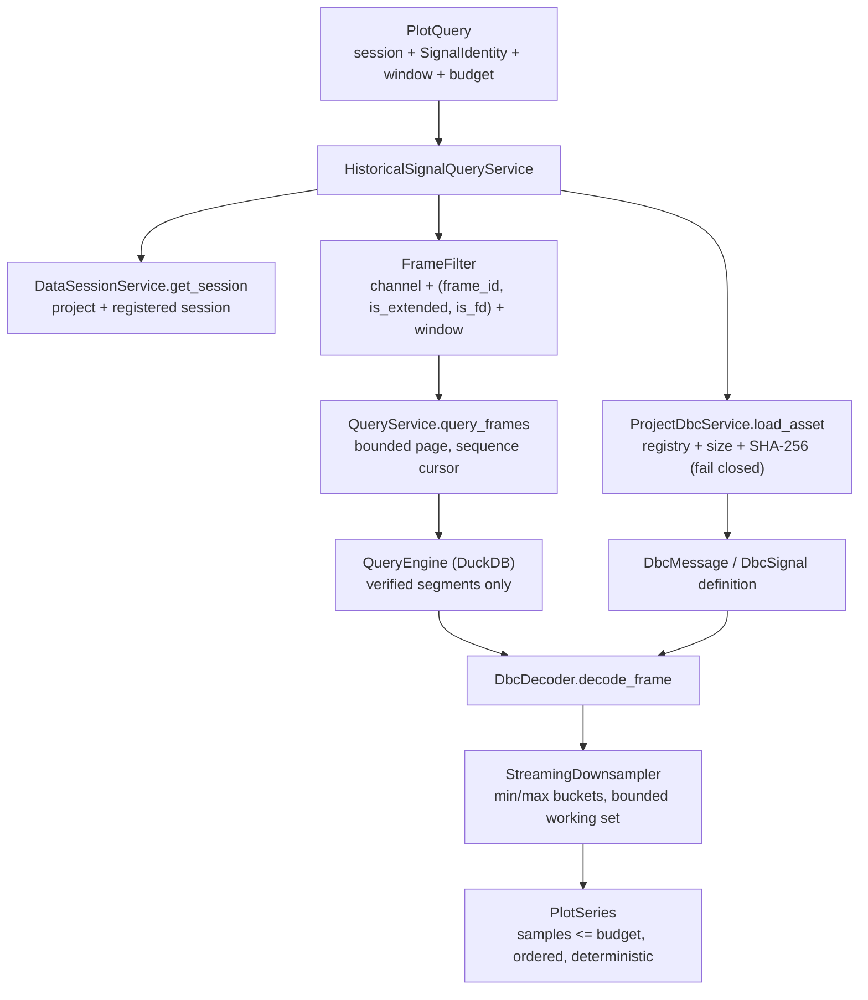

# V0.4-04 — Historical Signal Query + Downsampling Foundation

> **Phase**: V0.4-04
> **Branch**: `agent/V0.4-04-historical-plot-query`
> **Base**: `127ee2ff3ba0600afc3c7826e879981ef0a64867`
> **Worktree**: `.worktrees/v0.4-04-plot-query`
> **Status**: `IMPLEMENTED` — awaiting independent acceptance
> **Scope**: domain + service contract only. No Plot UI (V0.4-05) and no HTTP/public API surface.

Written by the development agent. It records what was implemented and what was actually run. The
verdict is the reviewer's; independent acceptance is external.

---

## 1. Objective

Freeze the Runtime-side contract that turns a persisted CAN-X session into a **bounded,
deterministic signal series** for one exact signal identity, built strictly on the existing engines:

```text
Project
  -> registered DataSession          (canx.data.session.DataSessionService)
  -> verified Parquet segments       (canx.query.service.QueryService:
                                      resolve-within-root + footer validation)
  -> canonical Frame                 (bounded, sequence-ordered pages from QueryEngine)
  -> verified project-owned DBC      (canx.dbc.project_service.ProjectDbcService:
                                      registry row + size + SHA-256, fail closed)
  -> DbcDecoder                      (canx.dbc.decode.DbcDecoder)
  -> bounded PlotSeries              (canx.plot.downsample.StreamingDownsampler)
```

No second historical engine, no whole-session load, no frontend cache as authority, no bypass of
segment integrity, and no silently trusting a DBC file.



---

## 2. What was built

### 2.1 `runtime/canx/plot/` — the new domain package

| File | Responsibility |
|---|---|
| `errors.py` | `PlotError` hierarchy (`PlotValidationError`, `PlotSessionError`, `PlotAssetError`, `PlotSignalNotFoundError`, `PlotQueryError`), each carrying `code` · `message` · `details` · `recoverable` · `source` (SPEC §38). Every lower-level failure is translated with its original `code` kept in `details["cause"]`. |
| `model.py` | `SignalIdentity` (channel + asset + message + signal; `unit` is presentation and excluded from `==`/`hash`), `PlotSample`, `PlotQuery`, `PlotSeries`. `PlotSeries` refuses to exist above its own `sample_budget` or out of timestamp order. |
| `downsample.py` | `StreamingDownsampler` — a single-pass, order-preserving **hierarchical min/max** reducer (a proven deterministic equivalent of bucket min/max). `downsample_samples` is the tuple convenience wrapper. |
| `service.py` | `HistoricalSignalQueryService.query_signal_series` — the one entry point. Composes the three existing domains and owns nothing else. |
| `__init__.py` | The frozen public surface. |

### 2.2 Signal identity — never a bare name

`SignalIdentity` mirrors the V0.3 realtime `SignalSelection`
(`apps/desktop/src/workspace/session.ts`, read-only) so a historical series and a live series
describe the same thing:

```python
SignalIdentity(channel_id="can0", asset_id="<uuid>", message_name="EngineData",
               signal_name="EngineSpeed", unit="rpm")
```

Two same-named signals on two channels, in two assets, in two messages, or as two signals of one
message are four different identities and **can never be merged into one series** (see §4).

### 2.3 Downsampling — Runtime-side, online, bounded

The realtime frontend reduces a series with an even stride
(`apps/desktop/src/components/plot/series.ts`). That is correct for a few thousand live points but
is the wrong large-data answer: a blind stride lands wherever the arithmetic falls, so a brief
two-sample spike is discarded. The Runtime therefore uses **hierarchical min/max reduction**:

* buffer up to `sample_budget` points;
* on overflow, split the interior into contiguous buckets and keep each bucket's min **and** max,
  pinned between the first and last points;
* the first point, the last point, the global minimum and the global maximum are therefore always
  preserved;
* the working set tracks the budget, never the dataset;
* a stream at or below the budget is returned untouched.

Compaction lands the buffer near `3/4 · budget`, leaving `1/4 · budget` headroom, so a stream of
`n` points compacts `≈ 4n / budget` times at `O(budget)` each — linear overall.

---

## 3. Files changed

```text
runtime/canx/plot/__init__.py
runtime/canx/plot/errors.py
runtime/canx/plot/model.py
runtime/canx/plot/downsample.py
runtime/canx/plot/service.py
tests/unit/plot/test_plot_model.py
tests/unit/plot/test_plot_downsample.py
tests/integration/test_plot_query.py
tests/performance/test_plot_downsampling.py
docs/acceptance/v0.4-04-historical-plot-query.md
```

`runtime/canx/query/**`, `runtime/canx/data/**` and `runtime/canx/dbc/**` are **read-only
dependencies**: `QueryService`, `QueryEngine`, `DataSessionService` and `ProjectDbcService` are
composed unchanged.

---

## 4. Required tests (all present)

| Requirement | Test |
|---|---|
| empty session | `test_an_empty_session_yields_an_empty_series` |
| one point / two points | `test_a_single_point_series`, `test_a_two_point_series_is_ordered` |
| below / above budget | `test_a_series_below_the_budget_returns_every_frame`, `test_a_series_above_the_budget_is_bounded` |
| very large synthetic series | `test_a_large_synthetic_session_downsamples_end_to_end` (25 000 frames), `test_the_reducer_working_set_is_independent_of_input_length` (1 000 000 points) |
| first / last point preserved | `test_the_first_and_last_frames_are_preserved`, `test_the_first_point_is_always_preserved`, `test_the_last_point_is_always_preserved` |
| extreme spike preserved | `test_a_single_spike_survives_downsampling`, `test_a_single_point_spike_is_never_strided_away`, `test_a_negative_spike_is_never_strided_away` |
| time ordering preserved | `test_the_timestamps_are_ordered`, `test_time_ordering_is_preserved` |
| deterministic repeat result | `test_the_result_is_deterministic_across_repeats`, `test_the_reduction_is_deterministic_across_repeats` |
| channel isolation | `test_two_same_named_signals_on_two_channels_are_isolated` |
| asset isolation | `test_two_assets_with_the_same_signal_name_are_isolated` |
| message isolation | `test_two_messages_with_the_same_signal_name_are_isolated` |
| signal isolation | `test_two_signals_in_one_message_are_isolated` |
| invalid DBC asset | `test_an_unregistered_asset_fails_closed` |
| tampered DBC fails closed | `test_a_tampered_dbc_asset_fails_closed` |
| invalid project / session | `test_a_project_that_is_not_a_canx_project_is_refused`, `test_an_unregistered_session_is_refused`, `test_a_missing_project_database_is_refused` |
| window with no matching signal | `test_a_window_with_no_matching_signal_is_empty`, `test_a_channel_with_no_frames_is_a_valid_empty_series` |
| CAN FD frames | `test_can_fd_frames_decode_into_a_series` |
| structural bound + working set | `test_the_working_set_never_exceeds_the_budget`, `test_the_working_set_does_not_grow_with_the_dataset` |
| segment integrity is not bypassed | `test_a_tampered_segment_fails_through_the_query_layer` |

---

## 5. Verification (actually run, inside the worktree)

Interpreter: `C:/Users/86176/Desktop/CAN-X/.venv/Scripts/python.exe`.

```text
$ python -m pytest tests/unit/plot tests/integration/test_plot_query.py -q
70 passed

$ python -m pytest tests/performance/test_plot_downsampling.py -q -s
[downsampling] points=1000000 budget=1000 peak_working_set=1000 output=769 seconds=1.142
[plot-query] session_frames=25000 budget=1000 output=904 seconds=0.695
3 passed
```

The benchmark numbers above are reported, not asserted: no wall-clock threshold is a CI gate.

### 5.1 RED → GREEN evidence

The suite was shown to detect real defects, not to pass vacuously, by mutating the source and
observing the failure, then restoring (hashes verified unchanged after each restore):

| Mutation | Result |
|---|---|
| remove the `channel_ids=(identity.channel_id,)` axis from the frame filter | `test_two_same_named_signals_on_two_channels_are_isolated` **FAILED** (250 extra samples merged) |
| disable the reducer's compaction trigger | `test_the_working_set_never_exceeds_the_budget` and `test_a_series_above_the_budget_is_bounded` **FAILED** (`PlotValidationError: A plot series must never carry more samples than its budget.`) |

---

## 6. Known limitations

* **No Plot UI and no HTTP surface.** This increment freezes the domain/service contract only; the
  Plot view is V0.4-05.
* **Downsampling starts reducing one point past the budget.** The reducer buffers up to exactly the
  budget, so the first compaction happens on point `budget + 1`; a series just above the budget is
  coarsened to roughly `3/4 · budget`. This keeps the whole stream linear and memory bounded, and is
  the deliberate trade for a hard, checkable bound.
* **Per-frame decode failures contribute no sample.** A frame whose payload is too short, whose
  message is unknown, or whose multiplexed signal is inactive is silently skipped (as the realtime
  pipeline treats a failed decode outcome). Only the *asset* is fail-closed; a frame that does not
  carry the signal is data, not an error.
* **Ordering follows the session's canonical frame order.** Samples are read in the engine's fixed
  `sequence` order and finally sorted by `(time, sequence)`, so the timestamp order is guaranteed;
  pathological non-monotonic captures are reordered by time rather than dropped.
* **The reducer's minimum/maximum are `float` extrema over the physical value.** Choice labels are
  not plotted; the physical value is (as in realtime).
