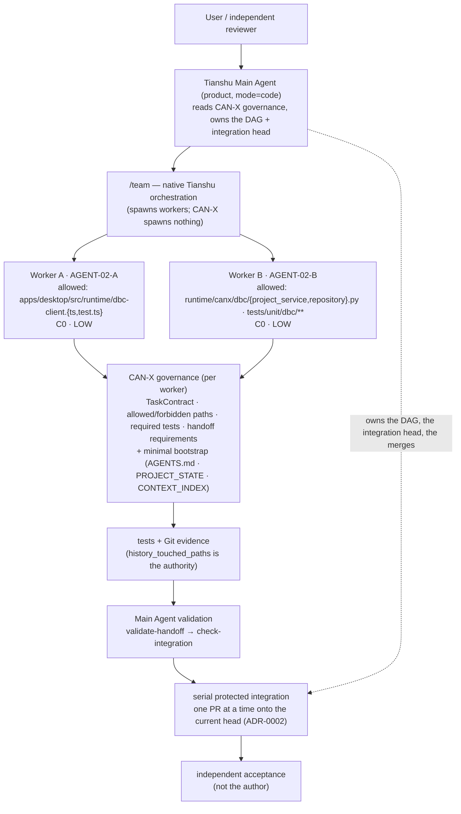

# CAN-X — AGENT-02 Pilot Plan (native harness)

> **Document**: `docs/engineering/AGENT_02_PILOT_PLAN.md`
> **Scope**: The first **real** Main Agent + worker pilot — workload, execution mode, ownership,
> conflicts, isolation, tests, integration order, failure recovery, acceptance boundary.
> **Status**: **EXECUTED — the first real pilot — · SELF-VERIFIED · AWAITING INDEPENDENT
> ACCEPTANCE**. The design below is preserved as the plan it was. The run is recorded in **§15**,
> and it used **1 Main Agent + 3 native Tianshu workers** — not the `1 + 2` this design assumed,
> because the host's native default worker concurrency is 3 and the pilot's purpose was to
> validate that default rather than a reconfigured harness.
> **Evidence**: `docs/acceptance/v0.3-12-desktop-project-open-foundation.md`
> **Remediation**: `V0.3-12-FIX-1` closed three P1 findings from independent acceptance — the
> governance step §9/§11 defines had never been run (the model could not express the measured
> shared-worktree mode), and §15.3's concurrency figure was withdrawn as unsupported and
> re-measured. See **§15.6**.
> **Execution mode**: **Tianshu native `/team`** — *not* a CAN-X-built Sub-Agent runtime.
> **Foundation**: `AGENT-02-NATIVE-HARNESS-PIVOT` **CLOSED** (head `cd44abc` → `main` `d652b4c`,
> protected PR #18, post-merge main CI `35415938987` SUCCESS). This plan is not yet executed.
> **Read first**: `docs/ADR/0003-native-agent-harness-orchestration.md` (the boundary this plan
> rests on), `docs/engineering/MULTI_AGENT_PROTOCOL.md`, `docs/ADR/0002-parallel-development-serial-integration.md`,
> `docs/engineering/INTEGRATION_POLICY.md`, `docs/engineering/AGENT_02_READINESS.md`.

## 1. Objective

Prove the **governance layer** holds when a **native orchestrator** runs real workers — not
throughput, and not a runtime CAN-X built itself:

```text
native execution             the Harness /team spawns the workers (CAN-X spawns nothing)
TaskContract enforcement      ownership enforced, not requested — a permission surface
context isolation             each worker gets its contract + minimal bootstrap, not Main history
handoff validation            the native worker result validated against real Git evidence
conflict management           the C0 claim verified, not assumed
serial integration            one PR at a time onto a moving integration head (ADR-0002)
acceptance boundary           the phase ends at "awaiting independent acceptance", never self-closed
```

Explicitly **not** the objective: a CAN-X worker scheduler, a model router, a message broker, a
message/agent runtime — those are **Harness-owned** (`ADR-0003`). Also not the objective: maximum
parallelism, a new product capability, V0.3-12, CD-01, Safety work, or a schema change.

## 2. Why the execution mode changed

`AGENT-02-PREP-01` designed the pilot as "the Main Agent dispatches Sub-Agents through CAN-X
tooling". The workspace inspection for this task found that the **host Harness is already a
multi-agent orchestrator** and exposes `/team`, `/scout`, `/council` natively, with worker
sessions, parallel scheduling, context isolation and model routing. Building a second one inside
CAN-X would be duplication (`ADR-0003`, rejected alternative).

The pilot therefore runs in the native mode:

```text
1 coordinator (Main Agent)  +  2 native Tianshu workers   — via /team
```

`max_sub_agents` stays **4** (unchanged, `AGENT-02 §2`). The first pilot runs **2**, because the
thing under test is whether CAN-X governance holds across two genuinely concurrent workers; a
third and fourth add capacity contention and C2+ surfaces without adding a new failure mode. A
1 + 4 **scale** validation is a separate, later task.

**Hard constraint:** the pilot must not quietly become "CAN-X dispatches workers". If a worker is
spawned by CAN-X tooling rather than by the Harness, the pilot no longer tests this architecture
and the run is void.

## 3. The two candidates

Both remain suitable after the architecture review: each is `LOW` risk, `PLANNED`, written as a
real contract, and the pair is **ownership-disjoint** and **C0** — which matters more in the
shared-workspace native mode (see §6). They stay in `.agent/tasks/`:

```text
.agent/tasks/AGENT-02-A.json
.agent/tasks/AGENT-02-B.json
.agent/tasks/agent-02-pilot.plan.json        (the plan document the CAN-X `plan` command consumes)
```

### Candidate A — `AGENT-02-A` · desktop DBC read-model client validation parity

| Field | Value |
| --- | --- |
| Objective | The DBC read-model client refuses a malformed Runtime read model at the client boundary — duplicate asset ids, duplicate frame ids in one database, `is_extended` disagreeing with `frame_id` — with a typed client error instead of admitting it into renderer state |
| Value | Closes the limitation recorded in `docs/PROJECT_STATE.md` §9 ("client-side validation is contract-shape validation, not a domain-semantics replica") |
| Risk | `LOW` — one client validator plus its suite; no Runtime, no Rust, no UI |
| Owner | `sub-a` |
| Branch (governance intent) | `agent/AGENT-02-A-dbc-client-validation` |
| Allowed paths | `apps/desktop/src/runtime/dbc-client.ts`, `apps/desktop/src/runtime/dbc-client.test.ts` |
| Forbidden | `apps/desktop/src-tauri/**`, `runtime/**`, `.agent/**` |
| Dependencies | none |
| Shared contract | `runtime/canx/api/dbc.py` (consumed, pinned at base) |
| Conflict | **C0** — verified |

### Candidate B — `AGENT-02-B` · read-only DBC asset orphan inspection

| Field | Value |
| --- | --- |
| Objective | A read-only inspection reports every file under the project DBC asset directory with no matching `dbc_assets` registry row (the "file written, row not committed" crash window), and separately a registered asset whose file is missing. Nothing is deleted or repaired — registry state stays authoritative |
| Value | Gives the recorded crash window (§9) the observability it lacks; a precondition for any future cleanup decision |
| Risk | `LOW` — read path plus unit tests; no migration, no HTTP endpoint, no Safety path |
| Owner | `sub-b` |
| Branch (governance intent) | `agent/AGENT-02-B-dbc-orphan-inspection` |
| Allowed paths | `runtime/canx/dbc/project_service.py`, `runtime/canx/dbc/repository.py`, `tests/unit/dbc/**` |
| Forbidden | `runtime/canx/api/**`, `runtime/canx/safety/**`, `runtime/canx/data/**`, `.agent/**` |
| Dependencies | none |
| Shared contract | none |
| Conflict | **C0** — verified |

Both are recorded limitations in the project's own register, not invented modules. Neither is a
Safety surface, a schema migration, a protected path, or a public-truth path, so neither can
deadlock the pair.

**Re-suitability check under native mode (why they still hold).** The native worker path is not
guaranteed to give each worker its own working tree (§6). The pair is still safe to run because it
was selected to be **path-disjoint and C0 by construction**: no file is owned by both, so
concurrent writers cannot collide even in one workspace — *provided* the TaskContract is enforced
(which is exactly what the pilot tests). A pair that shared a file would not be re-usable here.

## 4. Execution DAG



No edges between A and B: independent by construction. Integration is **serial** (ADR-0002) — A
first, then B rebased onto A's merge, because the integration head moves after every merge.

## 5. What the Harness does and what CAN-X does, per worker

```text
Harness decides HOW   spawn the worker · pick its model · isolate its context ·
                      persist its session · run how many in parallel ·
                      implement /team /scout /council

CAN-X decides WHAT    the TaskContract: objective · allowed_paths · forbidden_paths ·
                      shared_contracts · acceptance_criteria · required_tests ·
                      risk_class · handoff_requirements
```

CAN-X does **not** spawn the worker, does **not** choose its model, and does **not** build its
prompt transport. The Main Agent hands the native worker its contract and the minimal bootstrap;
everything else about the worker's execution is the Harness's.

## 6. Isolation — what is enforced where (observed, and to be recorded)

The workspace inspection produced two observable facts and one that must be **measured by the
pilot itself** (never assumed):

```text
observed   the native worker delegation path builds its coordinator with sharedWorktree: true
observed   the Harness separately has worker isolation: workerIsolationMode() ← RIVET_WORKER_ISOLATION
           (default enabled) → "isolated snapshot worktree"; Session Manager has isolatedWorktree
           (per-session worktree + branch + baseline, squash-merged back)
to measure whether two concurrent /team workers on THIS machine land in one working tree or in
           isolated worktrees, and where their commits land
```

The observable facts disagree at the level of the shipped code, and obfuscated runtime text is not
authority. So the **first recorded step of the pilot is an isolation observation** — a one-line
`git worktree list` / `git branch` capture while both workers are live. It is cheap, decisive, and
it converts the ambiguity into a recorded fact instead of a guess.

Two consequences either way, both already decided:

- **Ownership is enforced by policy, not by the filesystem.** `allowed_paths` in the TaskContract
  plus Git-derived `history_touched_paths` at validation is the enforcement. This is
  filesystem-independent and therefore holds whether or not the native path isolates worktrees.
  The C0/disjoint pair is what makes this sufficient for a first pilot.
- **The CAN-X worktree helper is retained as a governance adapter, not a runtime allocator**
  (`ADR-0003`). `tools/agent/worktree.py` encodes the CAN-X branch convention, binds a worktree to
  a task, and fails closed on unsafe states — governance the Harness does not implement. Whether
  the native runner materialises per-task worktrees is an observation the pilot records; it is not
  an assumption the plan rests on.

`TaskContract.branch` / `.worktree` in the two drafts record the **governance intent**; branch and
worktree identity are checked at the integration boundary (readiness rows R35 / R36), where CAN-X
can actually decide.

## 7. Workers and capacity

```text
coordinator    1   the Tianshu Main Agent — a product session (mode=code), reads CAN-X governance
workers        2   spawned by the Harness through /team, each handed one TaskContract
parallelism    native (Harness schedules); CAN-X still reports capacity for its own planning
max_sub_agents 4   unchanged ceiling in .agent/config.json (below which CAN-X defers)
```

CAN-X's `plan` / capacity accounting (R24, R25) is retained as **governance input**: the Main
Agent asks it "is this pair dispatchable and conflict-free?" before it calls `/team`. It does not
schedule the workers; it authorises them. Over-dispatch is still reported rather than rounded away.

## 8. Worker context (what a worker receives)

Each worker runs in a **native, isolated context** — it does **not** inherit the Main Agent's
history (`AGENT_CONTEXT_GOVERNANCE.md` §6, and the Harness's own `subagentPromptBlocks`). The
brief is exactly:

```text
task objective            from the TaskContract
allowed paths             the whole permission surface — anything else is not the worker's
forbidden paths           the explicit holes inside that surface
required authority        the Tier-1 sections the contract's surface touches
                          (resolved through docs/CONTEXT_INDEX.md)
required tests            the test names the handoff must report
handoff requirements      the exact evidence the worker must return
+ minimal bootstrap       AGENTS.md · docs/PROJECT_STATE.md · docs/CONTEXT_INDEX.md  (Tier 0 only)
```

No Main-Agent history. No full-project dump. The load rules stay
`docs/engineering/AGENT_CONTEXT_GOVERNANCE.md`; the routing stays `docs/CONTEXT_INDEX.md`. This
matches the Harness's own child-worker construction (a fresh `PromptEngine`, not the parent's
frozen prefix).

## 9. Handoff — consume native output, validate in CAN-X

The Harness already returns a structured worker result (`workOrderId · status · summary ·
findings · artifacts · changedFiles · risks · nextActions · evidenceStatus · failureReason`).
CAN-X does **not** build a second handoff runtime (`ADR-0003`).

```text
produced by   the native worker (Harness result envelope), mapped into the CAN-X handoff shape
validated by  python -m tools.agent.cli validate-handoff   (schema + Git-backed evidence)
              python -m tools.agent.cli check-integration  (ownership, base/head, deps, conflicts)
```

The **validation envelope is kept** because it decides things the native envelope only describes:
whether the history actually touched only owned paths (`history_touched_paths`), whether the base
is the current integration head (`check_base` → `agent.base_stale`), and whether the handoff's
`changed_files`/`commits` agree with real history. The Harness reports; CAN-X authorises.

Both handoffs must report: `task_id · agent · branch · base_sha · head_sha · commits ·
changed_files · ownership_compliance · tests[name, command, result] · lint · typecheck · ci ·
dependencies · known_issues · deferred_items · ready_for_integration`. `result` is one of
`passed / failed / skipped / not_run`; `not_run` is a complete answer and a pass nobody observed
is not. `validate-handoff` runs **before** `check-integration`.

## 10. Required tests

```text
AGENT-02-A   frontend-test        pnpm test          (root; delegates to @canx/desktop)
             frontend-typecheck   pnpm typecheck
             frontend-lint        pnpm lint
AGENT-02-B   unit                python -m pytest tests/unit/dbc -q
             (plus ruff + mypy reported in the handoff text)
```

A required test must be reported `passed`. `not_run`, `skipped` and `failed` remain legitimate
*reports* — they are simply not an integration-passing result. No test is skipped, deleted or
weakened to make anything green.

## 11. Expected integration order

```text
1  observe    capture git worktree list / branch while both workers are live   (§6, recorded)
2  A          handoff → validate-handoff → check-integration → PR → CI → protected merge
3  head moved by A's merge
4  B          rebase onto the new head → re-run tests → CI → protected merge
```

Serial integration is the protocol, not a limitation (ADR-0002). B's `check-integration` is
expected to fail with `agent.base_stale` until B is rebased onto A's merge — that refusal is the
mechanism working.

## 12. Failure recovery

| Failure | Expected mechanism |
| --- | --- |
| A worker needs a file outside `allowed_paths` | report `BLOCKED`; the Main Agent re-issues the contract at revision + 1; the worker never widens its own surface |
| A handoff claims `ready_for_integration` while its history touched an unowned path | `agent.ownership_violation` + `agent.handoff_evidence_mismatch`; rebase/re-issue, never edit the handoff to match |
| Two workers collide in the shared workspace | the C0/disjoint selection should prevent it; if it happens anyway it is a **recorded** result about the native isolation model, and the run stops — it is not patched over |
| A required test is not green | `agent.handoff_invalid`; the worker reports the real result rather than a pass |
| Base went stale between green CI and merge | `agent.base_stale`; update onto the current head, re-run CI, then merge |
| A worker terminates without integrating | the later conflicting task is *not* silently released; `replan_required` names the dead owner (C0 here, so this path is not armed) |
| The native runner spawns nothing / ignores the contract | **the run is void** — the pilot exists to test native execution under CAN-X governance; fall back to planning, not to a CAN-X dispatch runtime |

## 13. Main Agent responsibilities

```text
own the DAG and the integration head            one PR at a time, onto the current head
write both TaskContracts and validate them      never widen a surface after the fact
authorise the pair with CAN-X plan/conflicts    then call /team — the Harness spawns the workers
hand each worker its contract + minimal bootstrap   no context the contract does not name
record the isolation observation (§6)           never assume the isolation model
validate every handoff before integration       validate-handoff, then check-integration
integrate serially through the protected flow   never a direct push, never a bypass
record what is deferred and why                 never self-accept the phase
```

## 14. Independent acceptance boundary

```text
The pilot ends at:  awaiting independent acceptance.

The Main Agent may record   implemented · self-verified · evidence attached · awaiting acceptance
The Main Agent may not write   Final Acceptance: PASS · Status: CLOSED · "multi-agent verified"
```

A green CI is not acceptance (`docs/PROJECT_STATE.md` §14). This plan does not start the pilot, and
nothing in it may be cited as a pilot result: **REAL PILOT NOT STARTED**. A future genuinely
long-running pilot may also test long-duration context endurance; that endurance is
**NOT VERIFIED** and is not claimed by this plan.

---

## 15. Pilot execution record — the first real run

> Status: **EXECUTED · SELF-VERIFIED · AWAITING INDEPENDENT ACCEPTANCE**. Not `PASS`, not
> `CLOSED` — those are the independent reviewer's words to write. Full evidence:
> `docs/acceptance/v0.3-12-desktop-project-open-foundation.md`.

The pilot ran against **V0.3-12**, on `feature/v0.3-12-desktop-project-open-foundation` from
`main` `451352f`, with three workers instead of the two this design assumed.

### 15.1 Shape of the run

```text
1 Main Agent  +  3 native Tianshu workers        (the design said 1 + 2)
effective maxWorkers                     3
Harness concurrency configuration        NOT MODIFIED
                                         (Tianshu source, desktop runtime, RIVET_MAX_WORKERS and
                                          workers.maxWorkers all unchanged — no config editing
                                          was required, because 3 is the native default)
Worker A  V0.3-12-A  Desktop Runtime project read-model client        work order batch:0
Worker B  V0.3-12-B  Native project directory bridge                  work order batch:1
Worker C  V0.3-12-C  TS directory bridge + project-open orchestration work order batch:2
```

The three contracts were the ownership-disjoint, pairwise-**C0** pair this plan selected,
extended to a third: `plan` reported `runnable = [A, B, C]`, `conflicts` `(A,B) (A,C) (B,C)` all
`C0 auto_resolvable`, and no contract touching a protected, public-truth or safety path.

### 15.2 What §6 asked the pilot to *measure*, and what it measured

§6 left the per-worker filesystem model as a runtime observation, because the shipped code
contains both a coordinator built with `sharedWorktree: true` and a default-on isolation mode.

```text
Filesystem mode:  SHARED WORKTREE
```

Measured with an independent 2-second sampler over the whole dispatch window (151 samples,
389 s): `git worktree list` returned a **constant set of 5 worktrees** — the repository root on
the feature branch plus four pre-existing ones — and **no new worktree or branch appeared**.
All three workers' artifacts landed in the same working tree, on the same branch, in the same
`git status --porcelain`. No sample classifies as isolated.

This is the first real datum for the `workerIsolationMode()` / `sharedWorktree` ambiguity, and
it is why the C0/disjoint contract selection — not the filesystem — is what has to carry
ownership safety in native mode. It did: no two workers wrote the same file, so the shared-
worktree STOP condition in §6 was never reached.

### 15.3 Concurrency, context and ownership

```text
Three-worker concurrent overlap   WITHDRAWN as originally stated and re-measured — see §15.6.
                                  The first run's active-execution overlap is NOT VERIFIED;
                                  the instrumented rerun measured 25 s of strict three-way
                                  overlap (114 s if one long tool call counts as continued
                                  execution) with a peak of 3 simultaneously active workers.
Context isolation                 PARTIAL — each worker received only its own contract brief
                                  and no Main-Agent history (by dispatch construction and by
                                  observed behaviour); the assembled worker prompt itself was
                                  not directly observable, so full isolation is not claimed
Ownership from real Git           overlap NONE · forbidden-path violations NONE ·
                                  protected/public-truth/safety touches NONE (all paths C1)
Native worker envelopes           three, consumed as reports only and re-derived from the
                                  repository before any of them was cited as fact
```

### 15.4 What the run changed in this plan

- **§7 capacity.** Workers ran 3, not 2. `max_sub_agents` in `.agent/config.json` is still 4 and
  was not touched; the native ceiling that actually bound the run was the Harness default of 3.
  A 1 + 4 **scale** validation remains a separate, later task.
- **§6/§11 isolation step.** Measured and recorded (§15.2) rather than assumed.
- **§9 handoff.** The native envelopes were consumed as reports and re-derived against Git. One
  worker envelope carried absolute Windows paths alongside its relative ones; the mismatch was
  resolved by re-deriving `history_touched_paths` rather than by trusting either list.
- **§12 failure recovery.** Not exercised — no worker FAILED. Two of the three envelopes came
  back `blocked` from the Harness's own write gate (a scoped `tsc` that did not run to
  completion), with their own focused suites green; the Main Agent re-ran the full gates
  independently instead of treating either the block or the claim as evidence.

### 15.5 What this run still does not prove

```text
scale beyond 1 + 3                            NOT VERIFIED
long-duration context endurance               NOT VERIFIED
the Harness enforcing CAN-X ownership         out of scope by design — CAN-X keeps that duty
per-worker filesystem isolation               NOT PRESENT in this run (measured SHARED)
independent acceptance                        PENDING — the reviewer's verdict, not the author's
```

### 15.6 V0.3-12-FIX-1 — the closure this run was missing

Independent acceptance of the run above returned three P1 findings. Two were about **this plan
not being carried out**, and one was about **a claim stronger than its evidence**. Their
resolution is recorded in full in
`docs/acceptance/v0.3-12-desktop-project-open-foundation.md` §10; the parts that belong to *this
plan* are:

**§9 and §11 were not executed.** The three worker contracts stayed `PLANNED`, no handoff was
written, and `validate-handoff` / `check-integration` were never run — the exact step §9 defines
and §11 step 2–4 order. The root cause was not an operator omission: the AGENT-01 contract froze
`branch` + `worktree`, this run measured a **shared worktree** (§15.2) in which neither exists,
and `collect_repository_evidence` therefore failed closed with `agent.git_state_error` before it
could inspect the delivery. A model that cannot describe the execution mode cannot validate its
result.

That gap is now closed by an explicit **`execution_mode`** (`isolated-worktree` | `native-shared`)
plus **`integration_paths`**, defined in ADR-0003 and `MULTI_AGENT_PROTOCOL.md` §20. What this
plan said in §9 — consume the native envelope, validate it in CAN-X, prove ownership from Git —
is unchanged; what changed is that the contract can now name the mode it is validating. The
three contracts were re-issued at revision 2 and all six governance commands now run green:

```text
validate-task     V0.3-12-{A,B,C}   exit 0 · exit 0 · exit 0
validate-handoff  V0.3-12-{A,B,C}   exit 0 · exit 0 · exit 0
check-integration V0.3-12-{A,B,C}   exit 0 · exit 0 · exit 0   ready = True · blockers = []
```

**§15.3's concurrency figure was wrong.** "All three workers' artifacts present for 302 s" is a
statement about the working tree, not about workers executing; it is withdrawn, and the first
run's active-execution overlap is `NOT VERIFIED` — the harness work orders carry no timestamps
at all, and the per-worker checkpoints have internally inconsistent field semantics. §13 of this
plan asks for provable concurrency, so it was re-measured with an instrumented rerun (1 Main +
3 native workers, pairwise C0, ownership-disjoint, read-only), each worker emitting a heartbeat
that only it writes, read by an independent sampler alongside the OS process table:

```text
dispatch window                    03:59:56 → 04:03:57 UTC   (105 samples, 241 s)
all three first heartbeats         04:00:10 — the same second
strict three-way overlap           25 s   (activity-gap threshold 60 s)
                                    114 s if one 67 s gap counts as continued execution
max simultaneously active workers  3
node.exe                            baseline 5 → peak 12
Harness maxWorkers                 3          concurrency config modified: NO

parallelism verified  YES
speedup verified      NO — no single-agent baseline exists, so no speed-up is claimed
```

§13's requirement that the run be *proved* concurrent rather than *asserted* now has an
instrument that satisfies it, and the instrument is reusable: it lives in the dispatch brief
(heartbeat) and in an external sampler, not in product code.

**V0.3-12-FIX-2 closed the two gaps this section left open.**

1. **The concurrency evidence is now recomputable from the pull request.** The rerun's raw
   artefacts lived under the gitignored `.rivet/`, so a reviewer could not re-derive the figures
   above. They are transcribed verbatim into the committed
   `.agent/telemetry/v0.3-12-concurrency-rerun.json`, and
   `tests/unit/pilot/test_concurrency_telemetry.py` recomputes worker first/last heartbeats, the
   activity windows, the peak simultaneously-active count and the strict three-way overlap from
   the raw heartbeat and sampler sequences, refusing any disagreement with the reported numbers.
   The strict figure is defined precisely: it is the **longest continuous** interval in which all
   three workers are inside an activity window (two such intervals exist — 22 s and 25 s; the
   reported 25 s is the longer), and 114 s remains the conditional reading in which worker B's
   single 67 s gap is one long tool call.
2. **`integration_paths` no longer claims provenance it cannot prove.** Per
   `docs/ADR/0003-native-agent-harness-orchestration.md` and `MULTI_AGENT_PROTOCOL.md` §20.1, the
   field names Main-Agent-*reviewed* files permitted to coexist in a delivery *range*, each an
   exact repository-relative path (globs refused). The Git gate proves the range's composition and
   its governed-path safety; it never proves per-file writer provenance inside a shared worktree.
