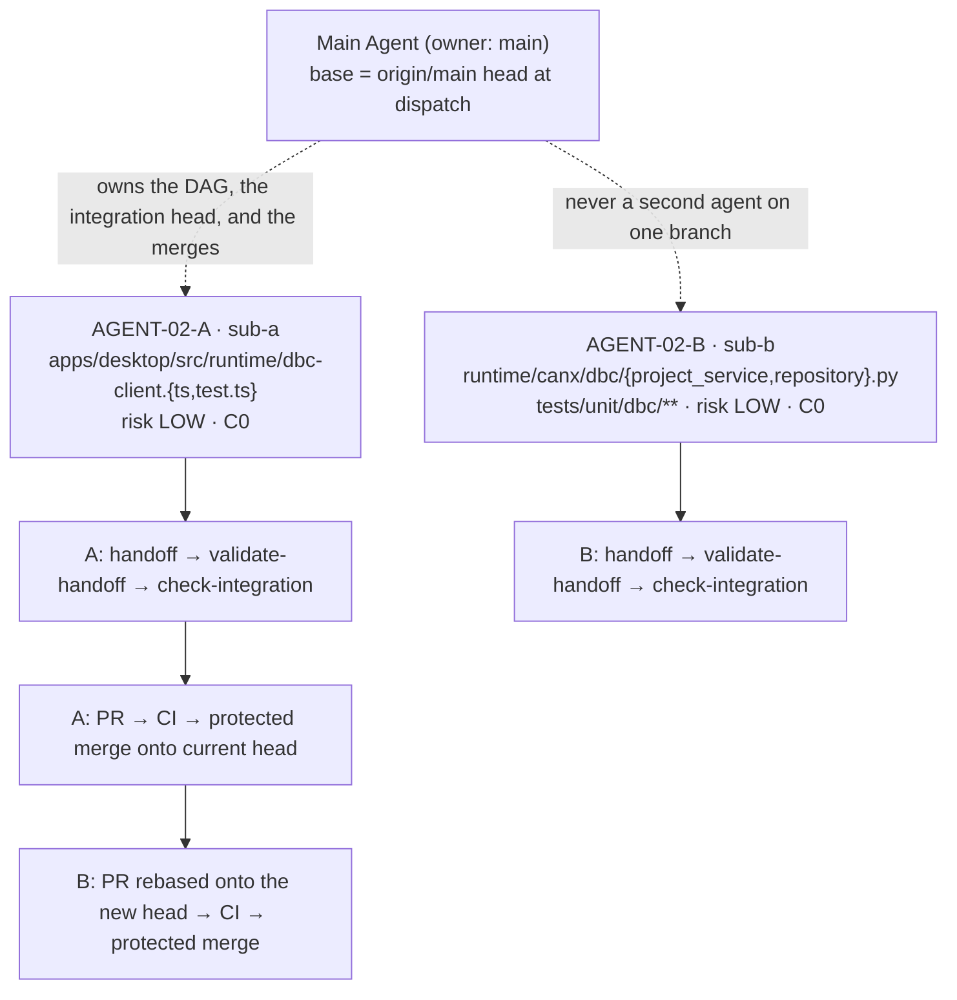

# CAN-X — AGENT-02 Pilot Plan (first real pilot)

> **Document**: `docs/engineering/AGENT_02_PILOT_PLAN.md`
> **Scope**: The first **real** Main Agent + Sub-Agent development pilot: workload, DAG,
> ownership, conflicts, worktrees, tests, integration order, failure recovery.
> **Status**: DESIGNED · **REAL PILOT NOT STARTED** · contract drafts are `PLANNED`, never dispatched.
> **Drafted at**: `maintenance/agent-02-preparation` @ `63a1b26` (from `origin/main` `bf88873`).
> **Read first**: `docs/engineering/MULTI_AGENT_PROTOCOL.md`,
> `docs/ADR/0002-parallel-development-serial-integration.md`, `docs/engineering/INTEGRATION_POLICY.md`,
> `docs/engineering/AGENT_02_READINESS.md` (the audit this plan rests on).

## 1. Objective

Prove the **coordination machinery** on real work — not throughput:

```text
real parallel execution      two Sub-Agents implementing at the same time
branch isolation             one branch, one agent, one task
worktree isolation           .worktrees/agent-02-a · .worktrees/agent-02-b
TaskContract                 ownership enforced, not requested
handoff                      a real handoff from real work, validated against Git
evidence                     ownership re-derived from base..head history
conflict management          the C0 claim verified, not assumed
serial integration           one PR at a time onto a moving integration head
```

Explicitly **not** the objective: maximum parallelism, new product capability, V0.3-12, CD-01,
Safety work, or a schema change.

## 2. Why 1 Main Agent + 2 Sub-Agents

`max_sub_agents` stays **4** (unchanged). The first pilot runs **2**, because the thing being
tested is whether the protocol holds when two Sub-Agents are genuinely concurrent — a third and
fourth add capacity contention and C2+ surfaces without adding a new failure mode. After one
successful 1 + 2 pilot, a 1 + 4 **scale** validation becomes a separate, later task.

A 1 + 4 first pilot would confound "does coordination work?" with "does the capacity cap behave?".
Both matter; only the first is unproven.

## 3. The two candidates

Both are written as real `PLANNED` contracts, executable through the shipped tooling:

```text
.agent/tasks/AGENT-02-A.json
.agent/tasks/AGENT-02-B.json
.agent/tasks/agent-02-pilot.plan.json        (the plan document the `plan` command consumes)
```

### Candidate A — `AGENT-02-A` · desktop DBC read-model client validation parity

| Field | Value |
| --- | --- |
| Objective | The DBC read-model client refuses a malformed Runtime read model at the client boundary — duplicate asset ids, duplicate frame ids in one database, `is_extended` disagreeing with `frame_id` — with a typed client error instead of admitting it into renderer state |
| Value | Closes the limitation recorded in `docs/PROJECT_STATE.md` §9 ("client-side validation is contract-shape validation, not a domain-semantics replica") |
| Risk | `LOW` — one client validator plus its suite; no Runtime, no Rust, no UI |
| Owner | `sub-a` |
| Branch | `agent/AGENT-02-A-dbc-client-validation` |
| Worktree | `.worktrees/agent-02-a` |
| Allowed paths | `apps/desktop/src/runtime/dbc-client.ts`, `apps/desktop/src/runtime/dbc-client.test.ts` |
| Forbidden | `apps/desktop/src-tauri/**`, `runtime/**`, `.agent/**` |
| Dependencies | none |
| Shared contract | `runtime/canx/api/dbc.py` (the read-model shape it consumes), pinned at base |
| Conflict | **C0** — verified |

### Candidate B — `AGENT-02-B` · read-only DBC asset orphan inspection

| Field | Value |
| --- | --- |
| Objective | A read-only inspection reports every file under the project DBC asset directory with no matching `dbc_assets` registry row (the "file written, row not committed" crash window), and separately a registered asset whose file is missing. Nothing is deleted or repaired — registry state stays authoritative |
| Value | Gives the recorded crash window (§9) the observability it lacks; a precondition for any future cleanup decision |
| Risk | `LOW` — read path plus unit tests; no migration, no HTTP endpoint, no Safety path |
| Owner | `sub-b` |
| Branch | `agent/AGENT-02-B-dbc-orphan-inspection` |
| Worktree | `.worktrees/agent-02-b` |
| Allowed paths | `runtime/canx/dbc/project_service.py`, `runtime/canx/dbc/repository.py`, `tests/unit/dbc/**` |
| Forbidden | `runtime/canx/api/**`, `runtime/canx/safety/**`, `runtime/canx/data/**`, `.agent/**` |
| Dependencies | none |
| Shared contract | none |
| Conflict | **C0** — verified |

Both are recorded limitations in the project's own register, not invented modules. Neither is a
Safety surface, a schema migration, a protected path, or a public-truth path, so neither can
deadlock the pair.

## 4. Task DAG



No edges between A and B: independent by construction. Integration is **serial** (ADR-0002) —
A first, then B rebased onto A's merge, because the integration head moves after every merge.

## 5. Ownership boundaries and shared contracts

```text
ownership = a permission surface, not a request. Anything not listed is not editable.
```

- The two surfaces are disjoint: `apps/desktop/src/runtime/**` versus `runtime/canx/dbc/**` +
  `tests/unit/dbc/**`. Neither task may touch the other's files, and neither may touch `.agent/**`.
- A declares one shared contract (`runtime/canx/api/dbc.py`) it **consumes** and may not change.
  B declares none. A Sub-Agent that finds a consumed contract wrong reports `BLOCKED` with a change
  request; it never edits it (`sub-agent.prompt.md`).
- Neither task may touch `runtime/canx/safety/**`, `runtime/canx/api/**` (A is forbidden from it
  explicitly), the protected path set, or any `public_truth_paths` entry. That is what keeps the
  pair at C0.

## 6. Conflict classification (verified, not asserted)

Run through the shipped classifier at the drafted head:

```text
python -m tools.agent.cli validate-task --file .agent/tasks/AGENT-02-A.json   -> exit 0
python -m tools.agent.cli validate-task --file .agent/tasks/AGENT-02-B.json   -> exit 0
python -m tools.agent.cli plan --file .agent/tasks/agent-02-pilot.plan.json   -> exit 0

classify_pair(A, B)        -> C0   auto_resolvable = True   overlapping_paths = (none)
parallel_safe_pairs(A, B)  -> (('AGENT-02-A', 'AGENT-02-B'),)
requires_serial_review     -> A False · B False
risk_class                 -> LOW · LOW
```

`C0` is the expected and acceptable level for a first pilot. Had the classifier returned `C2`,
`C3` or `C4`, the pair would not run in parallel and the workload would be re-selected.

## 7. Worktree and branch layout

```text
branch     agent/AGENT-02-A-dbc-client-validation
worktree   .worktrees/agent-02-a
branch     agent/AGENT-02-B-dbc-orphan-inspection
worktree   .worktrees/agent-02-b
```

Created with the shipped helper only:

```bash
python -m tools.agent.cli worktree create --task-id AGENT-02-A \
  --branch agent/AGENT-02-A-dbc-client-validation \
  --path .worktrees/agent-02-a --base <origin/main head at dispatch>
python -m tools.agent.cli worktree validate --path .worktrees/agent-02-a \
  --branch agent/AGENT-02-A-dbc-client-validation
```

One branch, one agent, one task, one worktree. Worktree creation refuses a dirty repository, an
existing path or branch, and an unresolvable base — the preconditions are the tool's, not a
convention.

**`base_sha` generation rule.** The `base_sha` in the two drafts is the current known integration
head (`bf88873`) and exists so the contracts are parseable *now*. At dispatch, both are regenerated
to the then-current `origin/main` head. `base_sha` is not one of the frozen fields
(`FROZEN_FIELDS = objective, allowed_paths, shared_contracts`), so regenerating it needs no revision
bump; changing any frozen field does.

**Pre-flight (from the readiness audit, O-3).** Refresh the local `main` ref (`git fetch`) before any
cleanup: the local `main` was stale at `ae22b82` while `origin/main` was `bf88873`, and
`worktree remove` defaults its containment check to the local name. Pass
`--integration-branch origin/main` when the local ref is behind.

## 8. Required tests and handoff requirements

```text
AGENT-02-A   frontend-test        pnpm test          (root; delegates to @canx/desktop)
             frontend-typecheck   pnpm typecheck
             frontend-lint        pnpm lint
AGENT-02-B   unit                python -m pytest tests/unit/dbc -q
             (plus ruff + mypy reported in the handoff text)
```

A required test must be reported `passed`. `not_run`, `skipped` and `failed` remain legitimate
*reports* — they are simply not an integration-passing result.

Both handoffs must report: `task_id · agent · branch · base_sha · head_sha · commits ·
changed_files · ownership_compliance · tests[name, command, result] · lint · typecheck · ci ·
dependencies · known_issues · deferred_items · ready_for_integration`. `changed_files` is the union
of every path the task history touched — the same set the verifier derives, so an honest handoff and
the gate agree by construction.

`validate-handoff` runs **before** `check-integration` (readiness audit O-1: the write half of the
handoff has no CLI command, so the Sub-Agent produces the JSON and the validator is the only check).

## 9. Expected integration order

```text
1  A: handoff → validate-handoff → check-integration → PR → CI → protected merge
2  head moved by A's merge
3  B: rebase onto the new head → re-run tests → CI → protected merge
```

Serial integration is the protocol, not a limitation to work around (ADR-0002). B's
`check-integration` is expected to fail with `agent.base_stale` until B is rebased onto A's merge —
that refusal is the mechanism working.

## 10. Failure recovery

| Failure | Expected mechanism |
| --- | --- |
| A Sub-Agent needs a file outside `allowed_paths` | report `BLOCKED`; the Main Agent re-issues the contract at revision + 1; the Sub-Agent never widens its own surface |
| A handoff claims `ready_for_integration` while its history touched an unowned path | `agent.ownership_violation` + `agent.handoff_evidence_mismatch`; rebase/re-issue, never edit the handoff to match |
| A required test is not green | `agent.handoff_invalid`; the Sub-Agent reports the real result rather than a pass |
| Base went stale between green CI and merge | `agent.base_stale`; update onto the current head, re-run CI, then merge |
| A Sub-Agent terminates without integrating | the later conflicting task is *not* silently released; `replan_required` names the dead owner (C0 here, so this path is not armed) |
| Worktree left dirty after a failed run | `worktree remove` refuses (`agent.worktree_dirty`) — the scene is preserved for inspection, never force-deleted |
| Capacity: a third task appears | `capacity_deferred`, never an over-dispatch; `active_over_capacity` is reported rather than rounded away |

## 11. Main Agent responsibilities

```text
own the DAG and the integration head           one PR at a time, onto the current head
write both TaskContracts and validate them     never widen a surface after the fact
allocate branch + worktree per task            never two agents on one branch
dispatch both Sub-Agents with their contracts  no context the contract does not name
validate every handoff before integration      validate-handoff, then check-integration
integrate serially through the protected flow  never a direct push, never a bypass
record what is deferred and why                never self-accept the phase
```

## 12. Independent acceptance boundary

```text
The pilot ends at:  awaiting independent acceptance.

The Main Agent may record   implemented · self-verified · evidence attached · awaiting acceptance
The Main Agent may not write   Final Acceptance: PASS · Status: CLOSED · "multi-agent verified"
```

A green CI is not acceptance (`docs/PROJECT_STATE.md` §14). This plan does not start the pilot, and
nothing in it may be cited as a pilot result: **REAL PILOT NOT STARTED**.
