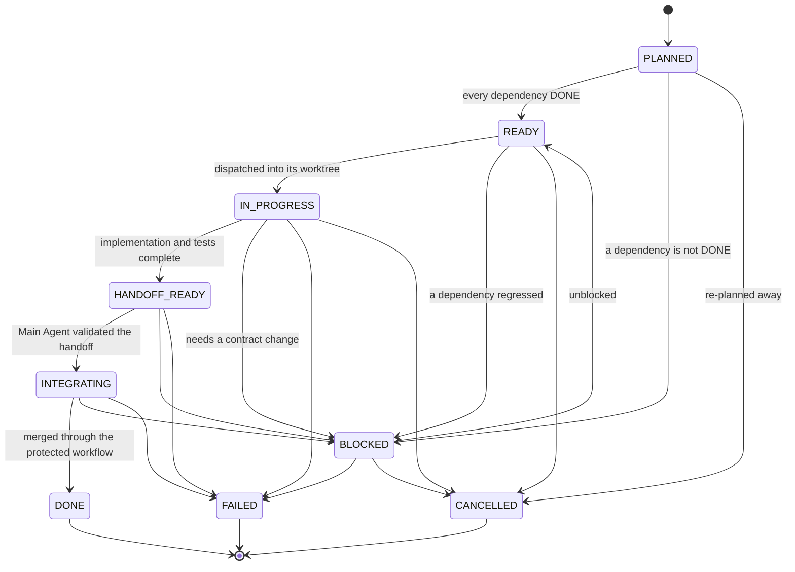

# CAN-X — Multi-Agent Orchestration Protocol

> **Document**: `docs/engineering/MULTI_AGENT_PROTOCOL.md`
> **Applies To**: the Main Agent and every Sub-Agent working on CAN-X
> **In force from**: AGENT-01 (Multi-Agent Orchestration Foundation)
> **Owner**: CAN-X sole author
> **Machine-checked by**: `tools/agent/` (config, contracts, graph, conflicts, validation, worktree, handoff, CLI)

This document is the protocol half of AGENT-01. The enforcement half is
`tools/agent/`, and the two are not interchangeable: a rule that is only written
here is a rule a tired agent can skip, which is why every gate below names the
validator that refuses it.

---

## 1. What AGENT-01 is

AGENT-01 does not add a way to run four AI agents. It adds the *contracts,
isolation and evidence* that make running up to four agents safe to attempt
later, in AGENT-02. Nothing in this phase spawns an agent, schedules a process,
brokers a message or executes a command taken from a task or handoff file.

The frozen principle:

> **Parallelism is earned by isolation.**

```text
no clear ownership             → no parallelism
no stable contract             → no parallelism
a high probability of conflict → serial
shared core truth              → Main Agent only
```

Development may be parallel. **Integration is not.**

---

## 2. Roles

### 2.1 Project owner

Owns the repository, the ruleset and the acceptance verdict. The only role that
may write `Final Acceptance: PASS` / `Status: CLOSED`, or use break-glass.

### 2.2 Main Agent

Owns:

```text
task decomposition        dependency analysis        the task DAG
ownership assignment       contract freezing          branch allocation
worktree allocation        handoff validation         integration order
conflict resolution        final status synthesis
```

The Main Agent does **not** implement every subtask — otherwise the structure
buys nothing. It is the only identity that may own a protected path
(`.agent/config.json` → `protected_paths`), and the only one that may run the
worktree and integration commands against the integration branch.

### 2.3 Sub-Agent

Owns exactly one task:

```text
one task        one bounded ownership surface     one branch
one worktree    implementation                     unit tests
integration tests (where applicable)              lint / typecheck
one PR                                                 one handoff
```

A Sub-Agent must never:

```text
widen its scope                     redefine a public contract
edit a path it does not own         edit another agent's ownership
merge its own PR                    self-accept its own work
use break-glass
```

The last three are not etiquette. There is no code path for a Sub-Agent to
merge, accept or disable the gate.

### 2.4 Independent reviewer

`development ≠ acceptance` still holds. A Main Agent may conclude
`READY_FOR_INTEGRATION`; it may never conclude `Final Acceptance: PASS`
(`docs/engineering/INTEGRATION_POLICY.md` §15,
`docs/PROJECT_STATE.md` §11).

### 2.5 Maximum parallelism

```text
1 Main Agent + up to 4 Sub-Agents
```

`.agent/config.json` pins `max_sub_agents: 4`, `AgentConfig.from_dict` refuses
anything outside `1..4` — and, since FIX-1, `plan()` **enforces** the cap rather
than merely validating the config: the dispatch wave is cut deterministically
from the integration order, and the tasks held back only by capacity are reported
as `capacity_deferred` so the three deferral reasons stay distinguishable:

```text
blocked by dependency   the dependency is not DONE
deferred by conflict    a C2+ conflict with an earlier in-flight task
deferred by capacity    ready and conflict-free, but past max_sub_agents
```

"Up to four" is a ceiling, not a target: the Main Agent starts the number of
Sub-Agents the DAG actually justifies.

---

## 3. Lifecycle



`DONE` means *integrated into the integration branch*. It does not mean *phase
accepted*. `FAILED` and `CANCELLED` are terminal; rework is a new task/revision,
not a revived terminal one.

The transition table lives in `tools/agent/lifecycle.py:ALLOWED_TRANSITIONS`; an
edge that is not in it raises `agent.task_invalid`.

### 3.1 Exit criteria

```text
HANDOFF_READY  implementation complete · required tests all PASS · ownership valid
               branch matches the contract · handoff schema valid
INTEGRATING    dependencies satisfied · no blocking conflict · task is HANDOFF_READY
               base is the current integration head · Git-backed evidence valid
               Quality Gate green on that head (GitHub, not this tooling)
DONE           the accepted head reached the integration branch
```

`tools/agent/validation.py:evaluate_integration` returns the whole blocker set,
not just the first, so an integration loop converges instead of ping-ponging.
It reports `ready` only when it could actually prove every local requirement:
with no repository or no task set it reports `agent.integration_context_incomplete`
rather than quietly skipping the check.

### 3.2 Local verdict versus platform gate

The two halves answer different questions and neither claims the other's job:

```text
local IntegrationReadiness   handoff schema · Git-backed evidence · ownership
                             base/current-head · dependency completion
                             conflict/deferral state · task readiness
GitHub Ruleset               Quality Gate green · protected PR workflow
merge eligibility            local READY
                             AND platform Quality Gate success on this head
                             AND base still current immediately before merge
```

`check-integration` does **not** verify the GitHub Quality Gate — `to_dict()`
says so explicitly (`github_gate.checked_here = false`). The ruleset requires it
independently; this tooling does not embed a GitHub client.

---

## 4. Ownership

> **Anything not explicitly owned is not editable.**

Ownership is a predicate over repository-relative paths, not an instruction to a
willing agent:

```text
allowed_paths      what this task may touch           (required, non-empty)
forbidden_paths    explicit holes inside that surface (they win over allowed)
```

Glob dialect, deliberately small and un-expandable:

```text
*    one path segment
**   zero or more path segments
?    one character, never a separator
```

Character classes are not supported and are matched literally, so no ownership
pattern can smuggle in a regular expression.

### 4.1 Path contract

Every path crossing the boundary is normalised first
(`tools/agent/paths.py:normalize_repo_path`). Refused:

```text
absolute paths            Windows drive prefixes        backslash separators
'..' segments             '.' or empty segments         NUL bytes
a trailing '/' on a pattern (use '/**' to own a subtree)
```

This is what makes traversal (`../../etc`), Windows/POSIX aliasing and
symlink-style surprises unrepresentable rather than merely discouraged.

### 4.2 Protected and high-contention paths

`.agent/config.json` names three classes. They are different questions and must
not be merged into one list.

| Class | Meaning | Effect |
| --- | --- | --- |
| `protected_paths` | Main-Agent-only surface: root manifests, lockfiles, CI workflows, `docs/PROJECT_STATE.md`, the AGENT-01 schemas, the central safety policy | A task whose `allowed_paths` touch one is refused with `agent.protected_path_conflict` unless the owner is `main` |
| `public_truth_paths` | Shared contracts: domain models, API surface, tool registry schema, safety package, the AGENT-01 schemas | Two tasks overlapping one classify at least C3 and may not be auto-integrated |
| `safety_paths` | `runtime/canx/safety/**`, `docs/architecture/SAFETY_ARCHITECTURE.md` | A task touching one is classified C4 and always requires serial review |

Protected paths are not permanently forbidden. They are *not parallel*: the Main
Agent either owns the change itself or re-plans the DAG so exactly one task
touches it.

### 4.3 Ownership enforcement

Ownership is decided by **the paths Git says were touched**, not by the list the
handoff reports. `validate_handoff` ignores the `ownership_compliance` flag a
handoff reports about itself — a self-assessment is not evidence — and the
authoritative check runs against `git diff --name-status -M -C <base>..<head>`.
A touched path that is not covered by `allowed_paths`, or that hits a
`forbidden_paths` entry, raises `agent.ownership_violation`.

This closes a real hole (FIX-1 §35): before it, a Sub-Agent could change
`SPEC.md`, report only `runtime/canx/foo/a.py`, and the gate would validate the
reported list against itself and pass.

### 4.4 Pattern versus pattern — the `**` hole

There are two different questions, and they need two different functions:

```text
a concrete file     vs an ownership pattern     matches_pattern / matching_pattern
an ownership pattern vs a protected pattern     patterns_overlap / overlapping_pattern
```

Using the first for the second is how a task owning `**` looked as though it
never touched `SPEC.md`: `SPEC.md` does not match the *literal text* `**`.
Protected ownership is therefore checked with overlap semantics — *can this
ownership surface reach a protected path?* — and a Sub-Agent task whose surface
can reach one is refused with `agent.protected_path_conflict`.

```text
allowed_paths = ["**"]                       owner = sub-a   -> REFUSED
allowed_paths = ["**/*.md"]                  owner = sub-a   -> REFUSED
allowed_paths = ["docs/**"]                  owner = sub-a   -> REFUSED
allowed_paths = ["runtime/canx/alpha/**"]    owner = sub-a   -> accepted
allowed_paths = ["**"]                       owner = main    -> accepted
```

The fix is correct overlap semantics, **not** banning globs: a genuinely
disjoint surface is still accepted.

**RED → GREEN #1 (`test_a_handoff_that_changes_a_file_outside_allowed_paths_is_refused`).**
Before a handoff's ownership was re-derived at all, one could claim
`ownership_compliance: true` and change `SPEC.md` while its task owned only
`runtime/canx/foo/**`. The validator accepted it (RED: `DID NOT RAISE
OwnershipViolationError`). With the gate wired in, the same input is refused
(GREEN).

---

## 5. Branch and worktree isolation

### 5.1 Branch convention

```text
Sub-Agent:   agent/<task-id>-<lower-kebab-slug>
Main Agent:  any valid ref (CAN-X uses maintenance/<slug>, docs/<slug>, …)
```

A Sub-Agent branch must encode its own task id, so a task cannot be developed on
the wrong branch by accident and then discovered at review time.
`validate_task` refuses a branch that does not start with `branch_prefix`, does
not carry the task id, or whose slug is not lower-case kebab-case.

### 5.2 One branch, one agent, one task

```text
Sub-Agent A + Sub-Agent B → the same branch     FORBIDDEN
```

`create_worktree` refuses a branch that already exists in `refs/heads`, and
refuses a branch that is checked out in another worktree.

### 5.3 Worktree layout

```text
repo-main/
  .worktrees/
    agent-02-a/     one branch · one agent · one task
    agent-02-b/
```

`.worktrees/` is gitignored, and it must stay that way: `create_worktree`
refuses a repository with uncommitted work, and an untracked worktrees directory
would make the repository dirty the moment the first task worktree exists.

### 5.4 The helper

```text
python -m tools.agent.cli worktree create  --task-id AGENT-02-B \
        --branch agent/AGENT-02-B-handoff-validator \
        --path .worktrees/agent-02-b --base <40-hex>
python -m tools.agent.cli worktree list
python -m tools.agent.cli worktree validate --path .worktrees/agent-02-b \
        --branch agent/AGENT-02-B-handoff-validator
python -m tools.agent.cli worktree remove  --path .worktrees/agent-02-b
```

There is no orchestration daemon, no scheduler and no server: four subcommands
over `git worktree`, which is the whole platform requirement.

### 5.5 Fail-closed rules

Before creating, the helper confirms:

```text
the directory is a git work tree, with the expected origin
the base is a full 40-hex commit that resolves
the branch is not already spoken for, and not checked out elsewhere
the target path is inside the repository and is not already a worktree
the repository has no uncommitted work
```

Before removing, it confirms:

```text
the path is a registered worktree of this repository, and not the main one
the worktree has no uncommitted work
the worktree HEAD is already contained in the integration branch
      (unless --allow-unmerged is passed explicitly)
```

Removal goes through `git worktree remove`. There is no `rm -rf` anywhere in the
module, and branch deletion uses `git branch -d`, never `-D`. A refused cleanup
leaves the evidence in place: a dirty worktree is never destroyed to tidy up.

---

## 6. Dependencies

```text
task_id
depends_on[]      other task ids that must be DONE first
blocks[]          derived: the inverse relation
status            one of the lifecycle states
```

Readiness is *derived*, never trusted: a task that has not started is `READY`
only when every dependency is `DONE`. A task already labelled `READY` whose
dependency is incomplete is demoted to `BLOCKED` — the label does not buy
scheduling. A `FAILED` or `CANCELLED` dependency is reported as unsatisfiable so
the Main Agent re-plans instead of waiting forever.

`TaskGraph.build` refuses a duplicate id, an unknown dependency, a self
dependency and a cycle (`agent.dependency_invalid`, `agent.dag_cycle`).

This is a dependency model, not a workflow engine. There is no retry policy, no
cron, no persistence and no queue.

---

## 7. Handoff

### 7.1 What a handoff contains

```text
task_id · agent · branch · base_sha · head_sha · commits · changed_files
ownership_compliance · tests[name, command, result] · lint · typecheck · ci
dependencies · known_issues · deferred_items · ready_for_integration
```

A handoff stores **facts, evidence and decisions**. It has no field for private
reasoning, no scratchpad and no chain-of-thought, and the `command` strings it
carries are text for a human to read: **nothing executes a command taken out of
a handoff file.**

`result` is one of `passed / failed / skipped / not_run`. `not_run` is a
first-class answer — "we did not run it" must be reportable as itself, never
smuggled in as a pass.

### 7.2 Git-backed verification (FIX-1)

A handoff is a **report format**. Git repository state is the **authority**. The
Main Agent's verifier independently compares the two:

```text
TaskContract            what is permitted
real worktree / branch  the strongest local source of truth
real base..head history what actually happened
real changed paths      the authority for ownership
local IntegrationReadiness  the verdict
```

`tools/agent/evidence.py` collects, and
`tools/agent/validation.py:verify_repository_evidence` compares:

```text
actual worktree branch  == task.branch                 agent.branch_mismatch
actual HEAD             == handoff.head_sha            agent.handoff_invalid
handoff.base_sha        == task.base_sha               agent.handoff_invalid
base is an ancestor of head (git merge-base)           agent.base_not_ancestor
worktree clean                                         agent.git_state_error
actual touched paths    -> ownership validation        agent.ownership_violation
handoff.changed_files   == actual touched paths        agent.handoff_evidence_mismatch
handoff.commits         == actual base..head range     agent.handoff_evidence_mismatch
```

Three consequences worth stating plainly:

- **A handoff cannot invent a base.** `handoff.base_sha` must equal
  `task.base_sha`; a legitimate rebase updates the *task contract* and re-issues
  it. Typing the current `main` into JSON does not make the delivery based on it.
- **Ancestry is proved, not assumed.** `git merge-base --is-ancestor` decides it;
  two values looking like commit ids proves nothing.
- **Both sides of a rename or copy count.** Paths come from
  `git diff --name-status -M -C`, so a protected file renamed into an owned
  subtree still appears under its old path, and a deleted protected path is still
  a protected-path modification.

When the worktree has been cleaned up, evidence falls back to the task *branch
ref* — still Git, still required to resolve to the claimed head — and the
fallback is recorded in `evidence.source` rather than hidden.

`build_handoff()` remains the convenient producer and is explicitly **not** a
trust boundary: the consumer assumes the JSON may have been edited after
generation. The same principle the Safety kernel already uses — a caller's
report is not authority — applies here.

### 7.3 Required tests

For `ready_for_integration == true`, **every** name in `task.required_tests` must
be present exactly once and reported as `passed`. `failed`, `skipped` and
`not_run` remain valid *reports* — a handoff that is honest about a test it did
not run is more useful than one that lies — but none of them is an
integration-passing result for a required test. Duplicate test names are refused
outright, so a passing copy cannot shadow a failing one.

### 7.4 Validation

`validate_handoff` refuses:

```text
a missing required field                    (agent.handoff_invalid)
a handoff for a different task              (agent.handoff_invalid)
a branch other than the task's branch       (agent.branch_mismatch)
a base or head sha that is not 40 hex       (agent.handoff_invalid)
head_sha == base_sha (no commit was made)   (agent.handoff_invalid)
zero reported tests                         (agent.handoff_invalid)
changed_files outside allowed_paths         (agent.ownership_violation)
changed_files inside forbidden_paths        (agent.ownership_violation)
"ready" while a required test is missing    (agent.handoff_invalid)
"ready" while a reported test failed        (agent.handoff_invalid)
"ready" while the handoff declares non-compliance (agent.handoff_invalid)
```

### 7.3 Where handoffs live

```text
.agent/handoffs/<task-id>.json    machine-readable
.agent/handoffs/<task-id>.md      human-readable
```

Both are produced by `tools/agent/handoff.py:write_handoff`, which builds the
handoff from the *live* repository state — branch, head, commits and changed
files are read from git, not typed in by the agent.

---

## 8. Conflicts

```text
C0  no overlap                          auto-integratable
C1  textual, low-risk overlap           auto-integratable
C2  semantic / shared-contract overlap  stop
C3  public-truth overlap                stop
C4  safety / migration / schema overlap stop
```

The level is computed from the *declared ownership surfaces*, before either
branch exists, and it errs upward: a false C2 costs one review, a false C0 costs
a broken `main`. Only C0/C1 may be resolved by the Main Agent under a fixed
rule; **C2 and above stop automatic integration** — the Main Agent re-plans, or
issues a serial task, or takes the change itself.

Two independent rules sit on top of the classification:

```text
a SAFETY_CRITICAL development task is serialised regardless of overlap
a task whose ownership touches a safety path is serialised regardless of overlap
```

When two ready tasks conflict above the ceiling, exactly one proceeds. The
deferral rule is deterministic — *the task later in integration order defers to
the earlier one* — so the verdict is reproducible rather than a judgement call
made under time pressure.

---

## 9. Integration

### 9.1 The one rule

> **Integration is serial, and it happens only through a PR with a green
> `Quality Gate` on the current integration head.**

```text
contract first  →  implementations second  →  consumers third
```

The Main Agent orders merges by the dependency DAG, then by whether a task
freezes a public-truth contract, then by task id. Producers of a contract always
land before its consumers.

### 9.2 Stale bases

A PR that was green on an old base is not known to be green on the new one.
`check_base` refuses any handoff whose `base_sha` is not the current integration
head (`agent.base_stale`). The remedy is the protocol's, not the agent's:

```text
update the branch onto the current integration head  →  full CI re-runs  →  then merge
```

**RED → GREEN #2 (`test_a_handoff_based_on_a_stale_commit_is_refused`).** Before
this gate existed, `check_base` validated the *shape* of the two shas and
returned; a handoff built on an obsolete `main` was integrated as if it had been
built on the current one (RED: `DID NOT RAISE BaseStaleError`). The comparison is
now the whole function (GREEN).

### 9.3 Individually-green, jointly-broken

See `docs/ADR/0002-parallel-development-serial-integration.md` for the full
decision. In one paragraph: CAN-X does **not** build a merge queue. Development
is parallel; merge is not. The Main Agent integrates one PR at a time, and each
PR must be based on the current integration head with a green gate on that head
— which `check_base` enforces as a machine predicate rather than a habit. The
ruleset's `strict_required_status_checks_policy` is currently `false`; the ADR
records turning it on as the platform-level backstop, to be applied as its own
deliberate, verified configuration change (§12).

### 9.4 The integration checklist

`READY_FOR_INTEGRATION` requires all of:

```text
handoff schema valid
ownership re-derived from the Git change set and valid
Git-backed evidence valid (branch, head, base, ancestry, clean worktree)
handoff.base_sha == task.base_sha and == the current integration head
dependencies satisfied (every dependency DONE)
no blocking conflict with an in-flight task
task status is HANDOFF_READY
every required test reported as passed
known limitations disclosed
GitHub Quality Gate green on this head          <- the platform, not this tooling
base still current immediately before the merge <- re-checked at merge time
```

---

## 10. GitHub CI

CI is the second, independent gate. It is required, it is automatic, and it is
not negotiable:

```text
PR must be green       "there is no CI run" is NOT a pass
red CI blocks the merge, always
```

The required check is `Quality Gate`, which already fails closed unless all
three domain jobs report `success`. AGENT-01 extends the Python job's lint and
type scope to the new tooling (`tools/agent`) so the tooling cannot rot outside
the gate the rest of the repository is held to. No test was skipped, deleted or
weakened, and nothing was added to `continue-on-error`.

---

## 11. Acceptance

```text
Local Verification   ≠   GitHub CI   ≠   Protected Merge   ≠   Independent Acceptance
```

A green gate means "safe to integrate". It has never meant "accepted", and no
agent may write `Final Acceptance: PASS` for its own work. The AGENT-01 phase
ends at `awaiting independent acceptance`; Level 4 stays `NOT STARTED` until an
external verdict says otherwise.

---

## 12. Safety interaction

AGENT-01 adds no dangerous capability: no TX, no replay send, no injection, no
diagnostic request, no ECU mutation, no new endpoint and no new UI control. It
does not touch `runtime/canx/safety/**`, and S1–S25 are unchanged.

What it does add is a *classification*: a task whose ownership surface reaches a
safety path, or whose `risk_class` is `SAFETY_CRITICAL`, is marked
`serial_review_required` and may never be integrated in parallel with another
task. A future safety-touching Sub-Agent task is therefore routed to serial
review automatically, not by remembering to ask.

`RiskClass` (development risk) is deliberately a different type from the
Runtime's `canx.safety.risk.RiskLevel` (vehicle-operation risk). A high-risk
development task is not a vehicle operation and the two must never be
conflated.

---

## 13. Failure recovery

| Situation | Status | Main Agent action |
| --- | --- | --- |
| Agent stalls or crashes | `FAILED` | Keep the branch and any partial handoff as evidence; cleanup only by explicit decision |
| Dependency fails | `BLOCKED` | Re-plan the DAG; do not "temporarily work around" the dependency |
| Base moved under a handoff | `HANDOFF_READY` | Update onto the current head, re-run CI, then integrate |
| Ownership conflict discovered | `BLOCKED` | Re-scope the task or reassign; never widen `allowed_paths` after the fact without a revision bump |
| A shared contract is wrong | `BLOCKED` + change request | The Main Agent owns the contract; no Sub-Agent silently redefines it |
| CI red on a PR | `FAILED` or fix forward | Never merge; never weaken the gate |

A crash means "the task stopped", not "the task is delisted": the worktree is
kept until the Main Agent decides, and evidence is not deleted to tidy up.

### 13.1 Cancellation

```text
status = CANCELLED
branch preserved · partial handoff preserved if it exists
worktree cleanup only after an explicit decision
```

Evidence is never auto-deleted.

### 13.2 Cleanup

`worktree remove` refuses a dirty worktree and refuses an unmerged branch
without an explicit `--allow-unmerged`. Cleanup is the last step of a task, not
a reflex.

---

## 14. Task immutability

Once a task is under way, three fields are frozen:

```text
objective        allowed_paths        shared_contracts
```

Changing one requires a revision bump, or a re-issued task.
`assert_frozen_unchanged` refuses a silent change; a status change never needs a
bump, because status is not a property of the assignment.

The point is that a Sub-Agent must not be able to discover, halfway through,
that its target moved.

---

## 15. Tooling map

```text
.agent/config.json                  the knobs: cap, path classes, branch prefix
.agent/schemas/task.schema.json     the task interchange contract
.agent/schemas/handoff.schema.json  the handoff interchange contract
.agent/examples/                    one valid task, one valid handoff, one
                                    ownership violation, one 4-task plan
.agent/prompts/                     the Main-Agent and Sub-Agent prompt templates
.agent/handoffs/                    where produced handoffs land
tools/agent/                        the enforcement (standard library only)
scripts/agent.cmd                   the Windows entry point
tests/unit/agent_tools/             the protocol's unit tests
tests/integration/                  the worktree lifecycle and the simulation
```

Exit codes are the contract: `0` success, `2` validation, `3` ownership /
conflict, `4` git state, `5` internal. Every failure prints
`{"code", "message", "details"}` — never a bare stack trace.

---

## 16. What AGENT-01 deliberately does not do

```text
no agent runtime, no provider SDK, no model name anywhere in the contract
no message broker, scheduler, database queue, daemon or dashboard
no real four-agent product pilot — that is AGENT-02
no product capability of any kind
```

`simulated multi-task orchestration verified` is the strongest claim this phase
may make. `four-agent parallel development verified` is not available to it, and
will not be until AGENT-02 runs against this protocol for real.
